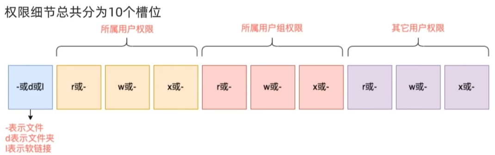
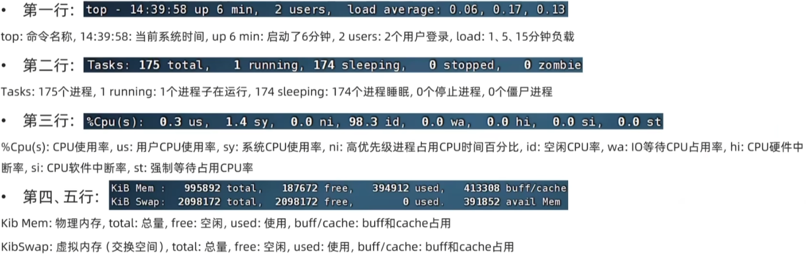

# Git

Git 有四个区域:

- 3个本地区域
  - 工作区(Workspace): 存放项目代码的地方。
  - 暂存区(Stage): 存放临时的改动, 事实上它只是一个文件, 保存即将提交的文件列表信息。
  - 资源库(Repository): 安全存放数据的位置, 这里面有提交到所有版本的数据。其中 HEAD 指向最新放入仓库的版本。
- 1个远程区域
  - 远程库(Remote): 托管代码的服务器。

`HEAD==>分支==>最新提交信息（版本号）`

Git常用命令：

- 基础命令：

  - `Git Bash Here`打开命令行

  - `git init`在当前目录创建仓库

  - `git clone https：（路径） 重命名`从外部从库下载

  - `git config user.name 用户名` `git config user.email 邮箱`配置用户信息

  - `git config --global user.name 用户名`全局配置，在c盘用户目录下的.gitconfig下找到全局配置文件

- 提交：

  - `git status`查看暂存区状态

  - `git add 文件名称`将工作区中被追踪的文件放入暂存区，`git add *.txt`扩展名为txt的文件全部放入暂存区

  - `git rm --cached  文件名称`放回工作区

  - `git commit -m 消息描述`将暂存区的文件提交到存储区

  - `git log (版本号)(--oneline)`（该版本之前的）提交历史记录，oneline是简化，==版本号可以用标签替代==

- 重置或恢复：

  - `git restore 文件名`工作区误删除之后修复

  - `git reset --hard 版本号`重置版本，该版本之后的提交记录会丢失

  - `git revert 版本号` 重新提交，回到该版本，这样不会丢失提交记录

- 分支：

  - `git branch 分支名`创建新的分支，前提是这个仓库有提交文件

  - `git branch -v`显示所有分支

  - `git checkout 分支名`切换分支

  - `git checkout -b 分支名`创建并切换分支

  - `git branch -d 分支名`删除分支

  - `git merge 分支名`合并其他分支，需要在主分支上完成，有异常则会停止等待我们处理（MERGING）：add 和commit

- 标签：

  - `git tag`所有标签

  - `git tag 标签名 版本号`创建标签

  - `git tag -d 标签名`删除标签


  - `git checkout -b <分支的名称> <tag的名称>` 创建分支名并打上对应标签

- 远程仓库：

  - 远程仓库克隆下来的仓库config配置文件中有`remote "名称"`代替url

  - `git remote add/rename/remove 名称 url`添加远程仓库

  - `git push/pull -u origin 分支`上传或者下载，前提是配置好了用户名和密码

  - SSH密钥：待完善


# Linux

## 初识

- 操作系统

  - 计算机由软件和硬件组成，而操作系统则是连接软件和硬件之间的桥梁，软件通过操作系统来调度硬件进行工作

  - 每一个操作系统都能进行图形化操作和命令行操作两种操作形式

  - 操作系统在pc上有三种，window和mac主要进行图形化操作，linux主要进行命令行操作
  - Linux图形化页面并未优化，不好用也不稳定，而命令行效率高更稳定并且资源占用低
- 内核

  - Linux的内核是免费且开源的，创始人林纳斯·托瓦兹在1991年上大学的时候发现有的操作系统不好用就创立了Linux发布在网上
  - 内核提供最核心的功能就是调度硬件的功能，比如调度cpu、调度内存等
  - 任何人都可以拿到Linux内核并修改，自行集成系统级程序，而内核+系统级程序的完整封装就是Linux发行版
- 虚拟机

  - 学习Linux就需要有一个可用的Linux系统，由于自己的电脑已经装有其他的系统所以我们可以借助虚拟机来虚拟一台电脑
  - 虚拟机的原理是通过软件来模拟计算机硬件并给硬件安装真实的操作系统，这样就可以虚拟一个电脑来装Linux系统
- 安装：
  - 下载安装VMware虚拟机
  - 下载CentOS操作系统：需要通过阿里云镜像网站下载
  - 新建虚拟机，并选择光盘映像文件为下载的CentOS操作系统
  - 自定义位置和硬件信息
- 优化（FinalShell）：
  - 在VMware中操作Linux命令行不太方便，也就是和Linux系统的各类交互不太方便比如内容的复制粘贴，文件的上传下载
  - 我们可以通过第三方软件FinalShell远程连接Linux系统
  - 查询Linux系统的ip地址：打开虚拟机，在桌面打开终端输入ifconfig命令，ens33下的inet就是ipv4地址
  - 在FinalShell中左上角的文件夹打开连接管理器，再左上角选择SSH连接，输入用户信息和ip地址就可以了
- WSL和Ubuntu
  - Win10全新特性WSL可以以轻量化的方式，得到Linux系统环境，相当于两套操作系统作用于一台电脑上
  - 在电脑程序与功能的设置下打开“适用于Linux的Windows子系统”重启即可
  - 微软应用商店直接下载Ubuntu，需要配置WSL
  - 如果想使用WSL1，使用管理员权限运行终端，输入wsl --set-default-version 1回车，再打开这个应用;
    如果想使用WSL2，打开Windows功能里面所有关于Hyper-v和虚拟机的相关项目，重新启动之后再打开这个应用。
- 在VMware中使用快照功能能将当前虚拟机的状态保存，方便以后虚拟机损坏的时候能快速还原

## 目录结构

- 在Windows系统中可以拥有多个盘符，如C盘、D盘、E盘，而在Linux系统中只有一个根目录' / '，所有文件和文件夹都在这个目录下

- 路径描述：以' / '开头，' / '表示层级关系（在Windows系统中层级关系使用反斜杠' \ '）

- HOME目录通常是默认的工作目录，每个用户都有一个自己专属同名的文件夹在home目录下并在此文件夹操作`/home/ytr`

- 绝对路径和相对路径：
  - 绝对：以根目录为起点，以`/`开头
  - 相对：以当前目录为起点，无需`/`开头
    - `.`表示当前目录
    - `..`回退上级目录
    - `~`HOME目录


## 基础命令

- 基本格式：`command [-options] [parameter]`
  - command：命令本身
  - options：命令的一些选项，控制命令的行为细节
  - parameter：命令的参数
- 重要符号：
  - 管道符`|`：将左边命令的结果作为右边命令的输入
  - 反引号符`` `：被反引号包围的内容会被当作命令执行而不是普通字符
  - 重定向符`>`、`>>`：
    - `>`：将左侧命令的结果**覆盖**写入到右侧指定的文件中
    - `>>`：将左侧命令的结果**追加**写入到右侧指定的文件中

- 基本命令

  - `ls [-a -l -h] [linux 路径]`：列出目录下的内容，默认HOME
    - `-a`：显示所有包括隐藏的文件夹，以' . '开头的文件会被隐藏
    - `-l`：以列表展示并展示更多信息
    - `-al,-la,-a -l`可以混合使用
    - ：和`-l`搭配使用展示文件大小的单位

  - `cd [linux路径]`：切换工作目录，不给参数直接回到HOME目录

  - `pwd`：输出当前工作目录
  
  - 文件/文件夹操作:
    - 创建文件夹：`mkdir [-p] linux路径`
      - `-p`：多级目录创建，能创建不存在的父目录
      - 创建文件夹操作超出HOME目录外会涉及权限问题

    - 创建一个新的文件`touch linux路径`

    - 查看文件内容`cat linux路径`

    - 分页查看文件内容`more linux路径`空格翻页，`Q`退出

    - 复制：`cp [-r] 参数一 参数二`复制参数一文件到参数二的目录下，`-r`复制文件夹
  
    - 移动：`mv 参数一 参数二`移动文件/文件夹，如果目标不存在则将移动文件改名
    - 删除：`rm [-r -f] 参数一···参数n`删除文件/文件夹，参数不限可以一次性删除很多
      - `-r`：删除文件夹
      - `-f`：强制删除，在管理员root的身份下删除文件需要确认提示
        - `su -root`切换root管理员需要输入密码，通过exit退回普通用户

  - 查找文件：
    - `which 要查找的命令`查找命令的程序文件
  
    - `find 起始路径 -name "被查找的文件名"`按文件名查找文件，可以支持通配符
      - `find 起始路径 -size |-n[kMG]`按文件大小查找
        - `find / -size -10k`查找小于10KB的文件
        - `find / -size +10M`查找大于10MB的文件
  
  - 过滤：
    - `grep [-n] 关键字 路径`从文件中通过关键字过滤文件行，`-n`表示在结果中显示匹配到的行号，==可作为管道符的输入==

    - `wc [-c -m -l -w] 文件路径` 统计文件的`-c`字节、`-m`字符数（唯一不默认）、`-l`行数、`-w`单词数==可作为管道符的输入==
  
  - 输出：`echo 输出的内容`在命令行输出指定内容，复杂内容需要通过双引号包围，==通常搭配符号使用==
  
  ```
  echo "hello linux" > test.txt
  echo `pwd` >> test.txt
  ```
  
  - `tail [-f -num] Linux路径`查看文件尾部内容，`-f`持续跟踪，`-num`填写数字表示查看尾部多少行

## vim

- 概述：

  - vi/vim编辑器是命令行模式下的文本编辑器，用来编辑文件

  - vim是vi的升级版，包含vi的全部功能

- 基础命令：`vim 文件路径`，如果文件路径表示的文件不存在则会创建新文件并进行编辑

- 运行模式：

  - 命令模式：默认的模式，可以通过键盘快捷键控制文件内容
  - 输入模式：通过命令模式进入，可以输入内容进行编辑，按esc退回命令模式
  - 底线命令模式：通过命令模式进入，可以对文件进行保存、关闭等操作

- 进入编辑模式

| 快捷键    | 功能描述                                                     |
| --------- | ------------------------------------------------------------ |
| i         | 在当前**光标所在位置插入**，光标后的文本相应向右移动         |
| I         | 在**光标所在行的行首插入**，行首是该行的第一个非空白字符，相当于光标移动到行首执行 i 命令 |
| o         | 在**光标所在行的下插入**新的一行。光标停在空行首，等待输入文本 |
| O（大写） | 在**光标所在行的上插入**新的一行。光标停在空行的行首，等待输入文本 |
| a         | 在当前**光标所在位置之后插入**                               |
| A         | 在**光标所在行的行尾插入**，相当于光标移动到行尾再执行 a 命令 |
| esc键     | 退出编辑模式                                                 |

- 命令模式

| 命令               | 描述                                             | 命令    | 描述                                                     |
| ------------------ | ------------------------------------------------ | ------- | -------------------------------------------------------- |
| gg                 | 光标移动到文档首行                               | x       | 删除**光标所在位置**的字符                               |
| jkhl               | 基本上下左右                                     | X(大写) | 删除**光标前**一个字符                                   |
| G                  | 光标移动到文档尾行                               | dd      | 删除**光标所在行**，删除之后，**下一行上移**             |
| v                  | 进行字符选中                                     | D       | 删除**光标位置到行尾**的内容，删除之后，**下一行不上移** |
| V 或shift+v        | 进行行选中                                       | ndd     | 删除当前行（包括此行）后 n 行文本                        |
| y                  | 复制已选中的文本到剪贴板                         | dw      | 移动光标到单词的开头以删除该单词                         |
| n+yy               | 复制光标所在行，此命令前可以加数字 n，可复制多行 | dG      | 删除光标所在行一直到文件末尾的所有内容                   |
| yw                 | 复制光标位置的单词                               | :a1,a2d | 删除从 a1 行到 a2 行的文本内容                           |
| ctrl+v + 方向键+yy | ctrl+v，并按方向键选中区块，按下yy复制           | u       | 撤销                                                     |
| p                  | 将剪贴板中的内容**粘贴到光标后**                 | ctrl+r  | 恢复                                                     |
| P（大写）          | 将剪贴板中的内容**粘贴到光标前**                 | U(大写) | 撤销所有编辑                                             |
| /abc               | 从光标所在位置**向前查找**字符串 abc             | ~       | 转换大小写                                               |
| /^abc              | 查找以 abc 为行首的行                            | u       | 变成小写                                                 |
| /abc$              | 查找以 abc 为行尾的行                            | U       | 变成大写                                                 |
| ?abc               | 从光标所在位置**向后查找**字符串 abc             | 0       | 移动行头                                                 |
| n或；              | 向下继续查找                                     | $       | 移动行尾                                                 |
| N或,               | 向上继续查找                                     | d0/d$   | 从当前光标开始删除到本行的开头/结尾                      |

- 底线命令模式

| 命令        | 功能描述                      |
| ----------- | ----------------------------- |
| :wq         | 保存并退出 Vim 编辑器         |
| :wq!        | 保存并强制退出 Vim 编辑器     |
| :q          | 不保存就退出 Vim 编辑器       |
| :q!         | 不保存，且强制退出 Vim 编辑器 |
| :w          | 保存但是不退出 Vim 编辑器     |
| :w!         | 强制保存文本                  |
| :w filename | 另存到 filename 文件          |
| x！         | 保存文本，并退出 Vim 编辑器   |
| ZZ          | 直接退出 Vim 编辑器           |

## 用户（权限控制）

- root用户是超级管理员，是最大权限的用户
- 用户切换：`su [-] [用户名] `
  - `-`：切换用户时加载环境变量，建议带上
  - 不填写用户名默认切换root用户
  - root用户切换普通用户不需要输入密码
- sudu认证：
  - 切换root用户，执行visudo即可自动通过vi编辑器打开/etc/sudoers配置文件
  - 在该文件的最后添加` 用户名 ALL=(ALL)  NOPASSWDL: ALL`即可使该用户通过sudu命令执行最高权限操作且不需要输入密码
  - wq保存即可使普通用户通过`sudu 其他命令`来短暂拥有root权限执行其他命令
- 用户和用户组：
  - Linux支持多用户多用户组和用户加入多组，权限管控单元是用户级别和用户组级别
  - 命令：
    - ` groupadd `、` groupdel`添加删除组
    - ` useradd 用户名 [-g -d]` 、`userdel [-r]`添加删除用户
      - ` -g`指定用户组，不指定则创建同名用户组
      - ` -d`指定用户HOME目录，不指定默认` /home/用户名`
      - ` -r`删除用户的HOME目录，不指定仅删除用户不删除目录

    - ` usermod -aG 用户组 用户名`修改用户组` id 用户名`查看 用户信息
    - ` getent password/group`查看系统全部用户/用户组信息
      - 信息：`用户名:密码(x):用户ID:组ID:描述信息(无用):HOME目录:执行终端(默认bash)`
- 权限细节
  - 通过` ls -l`查看所有权限细节
  - 
  - r代表读权限（如ls），w代表写权限，x代表执行权限（无法进入文件夹）
- 权限修改
  - `chmod [-R] 权限  文件或文件夹`修改文件/文件夹的权限细节
    -  -R表示对文件夹内的全部内容应用相同的权限
    - 只有文件所属用户或root用户能修改
    - 语法示例：`chome -R u=rwx,g=wx,o=x test`u代表用户本身，g代表用户组，o代表其他用户
    - ==快捷数字序号==：`chome 751 test.txt`，r=4，w=2，x=1，权限数字序号相加再拼凑即可,即`751==rwxr-x--x`

  - `chown [-R] [用户][:用户组] 文件/文件夹`修改文件/文件夹的所属用户/用户组
    - 只有root用户能修改

## 软件与服务

- 安装

  - yum命令（CentOS）

    - `yum [-y] install/remove/search 应用名称`下载安装/卸载/搜索应用
    - ` -y`表示自动确认
    - 需要root用户权限

    - apt命令（Ubuntu）
      - CentOS系统和Ubuntu系统使用的两款不同的包管理工具，分别为yum和apt管理器，安装包后缀分别为` .rpm`和`.deb`
      - `apt [-y] install/remove/search 应用名称`

- 服务

  - `systemctl start/stop/status/enable/disable 服务名`开启/关闭/查看状态/开启开机自启动/关闭开机自启
  - 内置服务：` NetworkManager`主网络服务、` network`副网络服务、` firewalld`防火墙、` sshd/ssh`远程登录
  - 第三方软件安装后也能用systemctl控制主要该软件内置注册服务功能如ntp（ntpd服务）和httpd

## 进阶命令

- 软连接（快捷方式）：` ln -s 参数一 参数二`将参数一的文件/文件夹的快捷方式发送到参数二的路径上去

- 日期与时区：

  - 显示日期：`date [-d] ["+格式化字符串"]`

    - ` -d`按照给定的字符串进行日期计算并显示，如` date -d "+1 month"`显示一个月前的时间

    - 格式化字符串 ：按照给定字符串格式显示日期如`+%Y-%m-%d`==`2023-07-07`

      | %Y   | %y         | %m   | %d   | %H   | %M   | %S   | %s                       |
      | ---- | ---------- | ---- | ---- | ---- | ---- | ---- | ------------------------ |
      | 年   | 年份后两位 | 月份 | 日   | 小时 | 分钟 | 秒数 | 时间戳（1970-01-01 UTC） |

  - 修改时区：

    - 手动修改：
      - 使用root权限执行`rm -f /etc/localtime`
      - 和`sudu ln -s usr/ share/ zoneinfo/Asia/Shanghai  /etc/localtime`
      - 即可修改时区到上海
    - 自动校准（ntp）：
      - 下载安装ntp并启动和打开开机自启动
      - 手动：`ntpdate -u ntp.aliyun.com`通过阿里云服务网址校准（需要root用户权限）

- 主机与域名解析

  - `hostname`查看主机名
  - `hostname set-hostname 主机名`修改主机名（需要root权限）
  - 域名解析会先在本地私人地址本查找ip和域名的关系，没有则采取DNS服务器找
    - Windows：C:\Windows\System32\drivers\etc\hosts
    - Linux：/etc/hosts
    - 在Windows的本地地址本中配置ip地址与主机名的映射，则FinalShell可通过主机名直接连接虚拟机

### 网络、端口与进程

- `ping [-c num] ip或主机名`检查网络服务器是否联通
- `wget [-b] url`下载网络文件
  - `-b`表示后台下载，会将日志写入当前工作目录的wget-log文件
  - 可以通过tail命令监控后台下载进度：`tail -f wget-log`
- `curl [-O] url`发送网络请求，`-O`表示下载保存文件
- Linux系统是一个超大号小区，可以支持65535个端口，这6万多个端口分为3类进行使用:
  - ·公认端口:1~1023,通常用于一些系统内置或知名程序的预留使用，如SSH服务的22端口，HTTPS服务的443端口非特殊需要，不要占用这个范围的端口
  - ·注册端口:1024~49151,通常可以随意使用，用于松散的绑定一些程序\服务
  - ·动态端口:49152~65535,通常不会固定绑定程序,而是当程序对外进行网络链接时，用于临时使用，比如发送一个网络请求
- 查看端口占用：
  - nmap和netstat需要先通过yum安装
  - `nmap ip地址`查看该ip地址下的端口占用情况`nmap 127.0.0.1` 
  - `netstat -anp [| grep 端口/进程]`查看端口占用情况通常搭配grep过滤使用来查看这个端口是否被占用
- 进程：
  - 操作系统中每一个应用程序运行时都会被注册一个进程，并为每一个进程分配独有的进程id
  - 查看进程：
    - `ps [-e -f]`：`-e`显示全部进程，`-f`以完全格式化的模式展示全部信息，一般直接`ps -ef`
    - `ps -ef | grep 关键字`通常通过过滤查看指定进程
    - `kill [-9] 进程id`关闭进程，`-9`强制关闭

| UID            | PID    | PPID     | C         | STIME    | TTY                  | TIME          | CMD            |
| -------------- | ------ | -------- | --------- | -------- | -------------------- | ------------- | -------------- |
| 进程所属用户id | 进程号 | 父进程号 | cpu占用率 | 启动时间 | 启动此进程的终端序号 | 总占用cpu时间 | 启动路径或命令 |

- `top`命令查看CPU、内存使用情况，相当于Windows的任务管理器，按q或CTRL+C退出，[详解](#TOP命令详解)

## 杂记

- ens33没有ip地址：打开网络适配器，启用桥接模式
- 特殊ip：0.0.0.0可以指代本机也表示所有ip（允许任意ip访问）
- 快捷键：
  - CTRL+L一键清空（clear命令相同）
  - CTRL+C强制停止，退出命令的输入
  - CTRL+D退出或登出（不适用于vi/vim）

- 历史命令：
  - history：查看历史命令，`history | grep ch`过滤包含ch的命令
  - " ! n"：从下往上搜索含有n前缀的命令并执行
  - CTRL+R：输入内容搜索历史命令，回车直接执行，键盘左右可更改
- 光标移动：
  - CTRL+A：跳到命令开头
  - CTRL+E：跳到命令结尾
  - CTRL+键盘左键：向左跳一个单词
  - CTRL+键盘右键：向右跳一个单词

# 附录

## TOP命令详解



| PID     | 进程id                                                       |
| ------- | ------------------------------------------------------------ |
| USER    | 父进程id                                                     |
| PR      | 优先级                                                       |
| NI      | 谦让度值 nice值。负值表示高优先级，正值表示低优先级          |
| VIRT    | 进程使用的虚拟内存总量，单位kb。VIRT=SWAP+RES                |
| SHR     | 共享内存大小，单位kb                                         |
| S       | 进程状态。D=不可中断的睡眠状态 R=运行 S=睡眠 T=跟踪/停止 Z=僵尸进程 |
| %CPU    | 上次更新到现在的CPU时间占用百分比                            |
| %MEM    | 进程使用的物理内存百分比                                     |
| TIME+   | 进程使用的CPU时间总计，单位1/100秒                           |
| COMMAND | 命令名/命令行                                                |

参数：

- -d：指定每两次屏幕信息刷新之间的时间间隔。当然用户可以使用s交互命令来改变之。
- -p:通过指定监控进程ID来仅仅监控某个进程的状态。
- -q:该选项将使top没有任何延迟的进行刷新。如果调用程序有超级用户权限，那么top将以尽可能高的优先级运行。
- -S：指定累计模式。
- -s：使top命令在安全模式中运行。这将去除交互命令所带来的潜在危险。
- -i：使top不显示任何闲置或者僵死进程。
- -c:显示整个命令行而不只是显示命令名。

