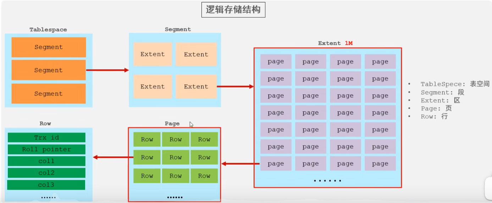

# MySql

## 启动

* MySQL服务启动
  	1. 手动。
  	2. cmd--> services.msc 打开服务的窗口
  	3. 使用管理员打开cmd
  
    * net start mysql : 启动mysql的服务
    * net stop mysql:关闭mysql服务
* MySQL登录
  1. mysql -uroot -p密码
  2. mysql -hip -uroot -p连接目标的密码
  3. mysql --host=ip --user=root --password=连接目标的密码
* MySQL退出
  1. exit
  2. quit

## SQL基础语法

- SQL分类
  - DDL(Data Definition Language)数据定义语言
       用来定义数据库对象：数据库，表，列等。关键字：create, drop,alter 等
  - DML(Data Manipulation Language)数据操作语言
       用来对数据库中表的数据进行增删改。关键字：insert, delete, update 等
  - DQL(Data Query Language)数据查询语言
       用来查询数据库中表的记录(数据)。关键字：select, where 等
  - DCL(Data Control Language)数据控制语言(了解)
       用来定义数据库的访问权限和安全级别，及创建用户。关键字：GRANT， REVOKE 等

### 通用语法

1. SQL 语句可以单行或多行书写，以分号结尾。

2. 可使用空格和缩进来增强语句的可读性。

3. MySQL 数据库的 SQL 语句不区分大小写，关键字建议使用大写。

4. 3 种注释

  * 单行注释: -- 注释内容 或 # 注释内容(mysql 特有) 
  * 多行注释: /* 注释 */

5. 备份与还原

  命令行：

  * 备份： mysqldump -u用户名 -p密码 数据库名称 > 保存的路径
  * 还原：

  	1. 登录数据库
  	2. 创建数据库
  	3. 使用数据库
  	4. 执行文件。source 文件路径

### DDL

#### 操作数据库

-  查询所有数据库：`show databases;`

- 查询当前数据库：`select database() ;`

- 创建数据库：`create database [ if not exists ] 数据库名 [ default charset 字符集 ] [ collate 排序 规则 ] ;`

- 删除数据库：`drop database [ if exists ] 数据库名 ;`
- 切换数据库：`use 数据库名 ;`

#### 操作表

##### 查询创建

- 查询当前数据库所有表：`show tables;`

- 查看指定表结构：`desc 表名 ;`

- 查询指定表的建表语句：`show create table 表名 ;`

- 创建表：
  ```
  CREATE TABLE 表名(
  字段1 字段1类型 [COMMENT 字段1注释 ],
  字段2 字段2类型 [COMMENT 字段2注释 ],
  字段3 字段3类型 [COMMENT 字段3注释 ],
  ......
  字段n 字段n类型 [COMMENT 字段n注释 ]
  ) [ COMMENT 表注释 ] ;
  ```

##### 数据类型

- 整数

| 数据类型  | 字节数 | 无符号数的取值范围     | 有符号数的取值范围                       |
| --------- | ------ | ---------------------- | ---------------------------------------- |
| TINYINT   | 1      | 0~255                  | -128~127                                 |
| SMALLINT  | 2      | 0~65535                | -32768~32768                             |
| MEDIUMINT | 3      | 0~16777215             | -8388608~8388608                         |
| INT       | 4      | 0~4294967295           | -2147483648~ 2147483648                  |
| BIGINT    | 8      | 0~18446744073709551615 | -9223372036854775808~9223372036854775808 |

- 浮点数和定点数（DECIMAL类型的有效取值范围是由M和D决定的。其中，M表示的是数据的长度，D表示的是小数点后的长度）

| 数据类型       | 字节数 | 有符号的取值范围                                 | 无符号的取值范围                                   |
| -------------- | ------ | ------------------------------------------------ | -------------------------------------------------- |
| FLOAT          | 4      | -3.402823466E+38~-1.175494351E-38                | 0和1.175494351E-38~3.402823466E+38                 |
| DOUBLE         | 8      | -1.7976931348623157E+308~2.2250738585072014E-308 | 0和2.2250738585072014E-308~1.7976931348623157E+308 |
| DECIMAL（M,D） | M+2    | -1.7976931348623157E+308~2.2250738585072014E-308 | 0和2.2250738585072014E-308~1.7976931348623157E+308 |

- 字符串类型
  - 在MySQL中常用CHAR 和 VARCHAR 表示字符串
  - 当数据为CHAR(M)类型时，不管插入值的长度是实际是多少它所占用的存储空间都是M个字节；
  - 而VARCHAR(M)所对应的数据所占用的字节数为实际长度加1

| 数据类型   | 储存范围         |
| ---------- | ---------------- |
| TINYTEXT   | 0~255字节        |
| TEXT       | 0~65535字节      |
| MEDIUMTEXT | 0~16777215字节   |
| LONGTEXT   | 0~4294967295字节 |

- 日期与时间

| 数据类型  | 字节数 | 取值范围                                | 日期格式            | 零值                |
| --------- | ------ | --------------------------------------- | ------------------- | ------------------- |
| YEAR      | 1      | 1901~2155                               | YYYY                | 0000                |
| DATE      | 4      | 1000-01-01~9999-12-31                   | YYYY-MM-DD          | 0000-00-00          |
| TIME      | 3      | -838：59：59~ 838：59：59               | HH:MM:SS            | 00:00:00            |
| DATETIME  | 8      | 1000-01-01 00:00:00~9999-12-31 23:59:59 | YYYY-MM-DD HH:MM:SS | 0000-00-00 00:00:00 |
| TIMESTAMP | 4      | 1970-01-01 00:00:01~2038-01-19 03:14:07 | YYYY-MM-DD HH:MM:SS | 0000-00-00 00:00:00 |

##### 修改

- 添加字段：
  ```
  ALTER TABLE 表名 ADD 字段名 类型 (长度) [ COMMENT 注释 ] [ 约束 ];
  ALTER TABLE emp ADD nickname varchar(20) COMMENT '昵称';
  ```

- 修改数据类型：`ALTER TABLE 表名 MODIFY 字段名 新数据类型 (长度);`

- 修改字段名和字段类型：
  ```
  ALTER TABLE 表名 CHANGE 旧字段名 新字段名 类型 (长度) [ COMMENT 注释 ] [ 约束 ];
  ALTER TABLE emp CHANGE nickname username varchar(30) COMMENT '昵称';
  ```

- 删除字段：`ALTER TABLE 表名 DROP 字段名;`

- 修改表名：`ALTER TABLE 表名 RENAME TO 新表名;`

##### 删除

- 删除：`DROP TABLE [ IF EXISTS ] 表名;`
- 删除并创建：`TRUNCATE TABLE 表名;`

### DML

1. 添加数据：
	* 语法：
		* insert into 表名(列名1,列名2,...列名n) values(值1,值2,...值n);
	* 注意：
		1. 列名和值要一一对应。
		2. 如果表名后，不定义列名，则默认给所有列添加值
			insert into 表名 values(值1,值2,...值n);
		3. 除了数字类型，其他类型需要使用引号(单双都可以)引起来
2. 删除数据：
	* 语法：
		* delete from 表名 [where 条件]
	* 注意：
		1. 如果不加条件，则删除表中所有记录。
		2. 如果要删除所有记录
			1. delete from 表名; -- 不推荐使用。有多少条记录就会执行多少次删除操作
			2. TRUNCATE TABLE 表名; -- 推荐使用，效率更高 先删除表，然后再创建一张一样的表。
3. 修改数据：
	* 语法：
		* update 表名 set 列名1 = 值1, 列名2 = 值2,... [where 条件];

	* 注意：
		1. 如果不加任何条件，则会将表中所有记录全部修改。

### DQL

==select * from 表名;==

1. 语法：
	```
	select
		字段列表
	from
		表名列表
	where
		条件列表
	group by 字段{
	分组之后查询的字段:1.分组字段,2.聚合函数
	where在分组之前限定,having在分组之后限定
	where后不可以跟聚合函数,having可以进行聚合函数的判断
	聚合函数可以取别名COUNT(id)人数
	}
	having
		分组之后的条件
	order by 
	排序字段1 排序方式1,排序字段2,排序方式2;
	排序方式:ASC 升序(默认),DESC 降序
	如果有多种排序条件,则当前边的条件值一样时,才会判断第二条件
	limit 开始的索引,每页查询的条数
	开始的索引=(当前页码-1)*每页显示的条数
	limit时一个MySQL的"方言"
	```

2. 基础查询
	1. 多个字段的查询
		select 字段名1，字段名2... from 表名；
		* 注意：如果查询所有字段，则可以使用*来替代字段列表。
	2. 去除重复：distinct
	3. 计算列
		* 一般可以使用四则运算计算一些列的值。（一般只会进行数值型的计算）
		* ifnull(表达式1,表达式2)：null参与的运算，计算结果都为null
			* 表达式1：哪个字段需要判断是否为null
			* 如果该字段为null后的替换值。
	4. 起别名：as：as也可以省略

3. 条件查询
	1. where子句后跟条件
	2. 运算符
		* <、> 、<= 、>= 、= 、<>
		* BETWEEN...AND  
		* IN( 集合) 
		* LIKE：模糊查询
			* 占位符：
				* _:单个任意字符
				* %：多个任意字符
		* IS NULL  
		* and  或 &&
		* or  或 || 
		* not  或 !
	
	4. 聚合函数
	   ```
	   1.count:计算个数(一般选择主键)
	   2.max:计算最大值
	   3.min:计算最小值
	   4.sun:计算和
	   5.avg:计算平均值
	   注意:聚合函数的计算会排除null值
	   解决方案:
	   1.选择不包含非空的行列进行计算
	   2.IFNULL函数:COUNT(IFNULL(englisn,0))
	   ```

### DCL

用来管理数据库用户、控制数据库的访问权限。

- 管理用户

  - 查询用户：`select * from mysql.user;`

  - 创建用户：`CREATE USER '用户名'@'主机名' IDENTIFIED BY '密码';`

  - 修改用户密码：`ALTER USER '用户名'@'主机名' IDENTIFIED WITH mysql_native_password BY '新密码' ;`

  -  删除用户：`DROP USER '用户名'@'主机名' ;`

- 权限控制

  - | 权限                | 说明               |
    | ------------------- | ------------------ |
    | ALL, ALL PRIVILEGES | 所有权限           |
    | SELECT              | 查询数据           |
    | INSERT              | 插入数据           |
    | UPDATE              | 修改数据           |
    | DELETE              | 删除数据           |
    | ALTER               | 修改表             |
    | DROP                | 删除数据库/表/视图 |
    | CREATE              | 创建数据库/表      |

  - 查询权限：`SHOW GRANTS FOR '用户名'@'主机名' ; `

  - 授予权限：`GRANT 权限列表 ON 数据库名.表名 TO '用户名'@'主机名;`

  - 撤销权限：` REVOKE 权限列表 ON 数据库名.表名 FROM '用户名'@'主机名';`

## 函数

- 字符串函数

| 函数                     | 功能                                                       |
| ------------------------ | ---------------------------------------------------------- |
| CONCAT(S1,S2,...Sn)      | 字符串拼接，将S1，S2，... Sn拼接成一个字符串               |
| LOWER(str)               | 将字符串str全部转为小写                                    |
| UPPER(str)               | 将字符串str全部转为大写                                    |
| LPAD(str,n,pad)          | 左填充，用字符串pad对str的左边进行填充，达到n个字符 串长度 |
| RPAD(str,n,pad)          | 右填充，用字符串pad对str的右边进行填充，达到n个字符 串长度 |
| TRIM(str)                | 去掉字符串头部和尾部的空格                                 |
| SUBSTRING(str,start,len) | 返回从字符串str从start位置起的len个长度的字符串            |

- 数值函数

| 函数       | 功能                               |
| ---------- | ---------------------------------- |
| CEIL(x)    | 向上取整                           |
| FLOOR(x)   | 向下取整                           |
| MOD(x,y)   | 返回x/y的模                        |
| RAND()     | 返回0~1内的随机数                  |
| ROUND(x,y) | 求参数x的四舍五入的值，保留y位小数 |

- 日期函数

| 函数                               | 功能                                               |
| ---------------------------------- | -------------------------------------------------- |
| CURDATE()                          | 返回当前日期                                       |
| CURTIME()                          | 返回当前时间                                       |
| NOW()                              | 返回当前日期和时间                                 |
| YEAR(date)                         | 获取指定date的年份                                 |
| MONTH(date)                        | 获取指定date的月份                                 |
| DAY(date)                          | 获取指定date的日期                                 |
| DATE_ADD(date, INTERVAL expr type) | 返回一个日期/时间值加上一个时间间隔expr后的 时间值 |
| DATEDIFF(date1,date2)              | 返回起始时间date1 和 结束时间date2之间的天 数      |

- 流程函数

| 函数                                                         | 功能                                                       |
| ------------------------------------------------------------ | ---------------------------------------------------------- |
| IF(value , t , f)                                            | 如果value为true，则返回t，否则返回 f                       |
| IFNULL(value1 , value2)                                      | 如果value1不为空，返回value1，否则 返回value2              |
| CASE WHEN [ val1 ] THEN [res1] ... ELSE [ default ] END      | 如果val1为true，返回res1，... 否 则返回default默认值       |
| CASE [ expr ] WHEN [ val1 ] THEN [res1] ... ELSE [ default ] END | 如果expr的值等于val1，返回 res1，... 否则返回default默认值 |

## 约束

* 概念： 对表中的数据进行限定，保证数据的正确性、有效性和完整性。	

* 分类：
	1. 主键约束：primary key
	2. 非空约束：not null
	3. 唯一约束：unique
	4. 外键约束：foreign key
	5. 检查约束(8.0.16版本 之后) 保证字段值满足某一个条件 check
	
* 非空约束：not null，值不能为null
	1. 创建表时添加约束
	
	  ```
	  CREATE TABLE stu(
	  			id INT,
	  			NAME VARCHAR(20) NOT NULL -- name为非空
	  		);
	  ```
	2. 创建表完后，添加非空约束
	    `ALTER TABLE stu MODIFY NAME VARCHAR(20) NOT NULL;`

	3. 删除name的非空约束
	    `ALTER TABLE stu MODIFY NAME VARCHAR(20);`
	
* 唯一约束：unique，值不能重复
  
  * 在创建表后，添加唯一约束
     `ALTER TABLE stu MODIFY phone_number VARCHAR(20) UNIQUE;`
  * 注意mysql中，唯一约束限定的列的值可以有多个null
  
   - 删除唯一约束:`ALTER TABLE stu DROP INDEX phone_number;`

- 主键约束：primary key。
  1. 含义：非空且唯一
  2. 一张表只能有一个字段为主键
  3. 主键就是表中记录的唯一标识

2. 在创建表时，添加主键约束
  ```
  create table stu(
  	id int primary key,-- 给id添加主键约束
  	name varchar(20)
  );
  ```

3. 删除主键
    ==错误 : alter table stu modify id int==
    ALTER TABLE stu DROP PRIMARY KEY;

4. 创建完表后，添加主键
    ALTER TABLE stu MODIFY id INT PRIMARY KEY;

5. 联合主键：
    PRAMARY KEY(字段，字段)两个字段作为表的主键，非空且唯一

6. 自动增长：
   	1.  概念：如果某一列是数值类型的，使用 auto_increment 可以来完成值得自动增长

  2. 在创建表时，添加主键约束，并且完成主键自增长

    ``` 
    `create table stu(
    id int primary key auto_increment,-- 给id添加主键约束和自动增长
    name varchar(20)
    );

  3. 删除自动增长`ALTER TABLE stu MODIFY id INT;`

  4. 添加自动增长`ALTER TABLE stu MODIFY id INT AUTO_INCREMENT;`


* 外键约束：foreign key,让表于表产生关系，从而保证数据的正确性。
	1. 在创建表时，可以添加外键
		* 语法：
			create table 表名(
				....
				外键列 constraint 外键名称 foreign key (外键列名称) references 主表名称(主表列名称)--一般是zhu'jian
			);
		
	2. 删除外键
		ALTER TABLE 表名 DROP FOREIGN KEY 外键名称;
	
	3. 创建表之后，添加外键
		ALTER TABLE 表名 ADD CONSTRAINT 外键名称 FOREIGN KEY (外键字段名称) REFERENCES 主表名称(主表列名称);
	4. 级联操作
			1. 添加级联操作
				语法：ALTER TABLE 表名 ADD CONSTRAINT 外键名称 
	   	 FOREIGN KEY (外键字段名称) REFERENCES 主表名称(主表列名称) ON UPDATE CASCADE ON DELETE CASCADE  ;
			2. 分类：
				1. 级联更新：ON UPDATE CASCADE 
				2. 级联删除：ON DELETE CASCADE 

## 数据库设计

### 多表之间的关系

1. 分类：
	1. 一对一(了解)：
		* 如：人和身份证
		* 分析：一个人只有一个身份证，一个身份证只能对应一个人
	2. 一对多(多对一)：
		* 如：部门和员工
		* 分析：一个部门有多个员工，一个员工只能对应一个部门
	3. 多对多：
		* 如：学生和课程
		* 分析：一个学生可以选择很多门课程，一个课程也可以被很多学生选择
2. 实现关系：
	1. 一对多(多对一)：
		* 如：部门和员工
		* 实现方式：在多的一方建立外键，指向一的一方的主键。
	2. 多对多：
		* 如：学生和课程
		* 实现方式：多对多关系实现需要借助第三张中间表。中间表至少包含两个字段，这两个字段作为第三张表的外键，分别指向两张表的主键
	3. 一对一(了解)：
		* 如：人和身份证
		* 实现方式：一对一关系实现，可以在任意一方添加唯一外键指向另一方的主键。

### 数据库设计的范式

  -  概念：设计数据库时，需要遵循的一些规范。要遵循后边的范式要求，必须先遵循前边的所有范式要求，​设计关系数据库时，遵从不同的规范要求，设计出合理的关系型数据库，这些不同的规范要求被称为不同的范式，各种范式呈递次规范，越高的范式数据库冗余越小。
  - 目前关系数据库有六种范式：第一范式（1NF）、第二范式（2NF）、第三范式（3NF）、巴斯-科德范式（BCNF）、第四范式(4NF）和第五范式（5NF，又称完美范式）。
  - 几个概念：
    1. 函数依赖：A-->B,如果通过A属性(属性组)的值，可以确定唯一B属性的值。则称B依赖于A
       	例如：学号-->姓名。  （学号，课程名称） --> 分数
    2. 完全函数依赖：A-->B， 如果A是一个属性组，则B属性值得确定需要依赖于A属性组中所有的属性值。
       例如：（学号，课程名称） --> 分数
    3. 部分函数依赖：A-->B， 如果A是一个属性组，则B属性值得确定只需要依赖于A属性组中某一些值即可。
       例如：（学号，课程名称） -- > 姓名
    4. 传递函数依赖：A-->B, B -- >C . 如果通过A属性(属性组)的值，可以确定唯一B属性的值，在通过B属性（属性组）的值可以确定唯一C属性的值，则称 C 传递函数依赖于A
       例如：学号-->系名，系名-->系主任
    5. 码：如果在一张表中，一个属性或属性组，被其他所有属性所完全依赖，则称这个属性(属性组)为该表的码
       例如：该表中码为：（学号，课程名称）
       * 主属性：码属性组中的所有属性
       * 非主属性：除过码属性组的属性

    * 分类：
      1. 第一范式（1NF）：每一列都是不可分割的原子数据项
      
      2. 第二范式（2NF）：在1NF的基础上，非码属性必须完全依赖于码（在1NF基础上消除非主属性对主码的部分函数依赖）
      3. 第三范式（3NF）：在2NF基础上，任何非主属性不依赖于其它非主属性（在2NF基础上消除传递依赖）

# Mysql进阶

## 存储引擎

- 体系结构

  - 连接层：接受客户的连接如jdbc，授权认证和权限

  - 服务层：核心功能，sql接口，解析器，查询优化器，缓存

  - 引擎层：控制mysql数据的存储和提取的方式，索引在这层实现

  - 存储层：主要用来存储数据库的数据

- 查询当前数据库的所有引擎：`show engines`

- 指定引擎：

```
create table *(
)engine=Innodb(默认引擎)
```

### Innodb

- 特点：==支持事务，行级锁，支持外键==
- 文件：xxx.ibd，每张表对应这样一个表空间，存储表结构、数据和索引



### MyISAM

- 特点：不支持事务和外键，支持表锁不支持行锁，访问速度快
- 文件：
  - xxx.sdi：存储表结构
  - xxx.MYD：存储数据
  - xxx.MYI：存储索引

### Memory

- 介绍：Memory引擎的表数据是存储在内存当中的，受到硬件或者断电问题的影响，只能当作临时表或者缓存使用
- 特点：内存存放，支持hash索引（默认）
- 文件：xxx.sdi：存储表结构信息

### 引擎选择

- Innodb：默认引擎，对于事务的完整性有较高的要求和并发条件下要求数据的一致性

- MyISAM：以读操作和插入操作为主，很少的更新和删除，并发要求低

- Memory：数据保存在内存，访问速度非常快，通常用于临时表和缓存，最大的限制就是对表的大小有限制

## 索引

### 介绍

- 通过索引列对数据进行排序，提高数据检索效率，可以大大提高查询效率，但是会降低插入更新和删除操作的效率

- 结构
  - BTree：多路平衡查找树，可以有多个节点，每个节点最多存储4个key5个指针，插满之后中间元素向上分裂
  - B+Tree：
    - 只有叶子节点存储数据并且所有数据都存在叶子节点上，上面的节点只有指针
    - 叶子节点也是插满之后中间元素向上变成节点指针，真实数据还在叶子节点
    - 叶子节点从左到右插入指针变成一条单向链表
    - Mysql对B+Tree有优化，每个叶子节点都和相邻叶子节点都有双向指针包括最左和最右，提高区间访问性能，而且每个节点包括叶子节点都用页保存
  - hashTree：
    - 哈希索引就是采用一定的hash算法，将键值换算成新的hash值，映射到对应的槽位上，然后存储在hash表
    - 如果两个(或多个)键值，映射到一个相同的槽位上，他们就产生了hash冲突（也称为hash碰撞)，可以通过链表来解决。
    - Hash索引只能用于对等比较(=，in)，不支持范围查询(between，>，<，..)
    - 无法利用索引完成排序操作，
    - 查询效率高，通常只需要一次检索就可以了（不发生hash碰撞），效率通常要高于B+tree索引
    - 在MySQL中，支持hash索引的是Memory引擎，而innoDB中具有自适应hash功能，hash索引是存储引擎根据B+Tree索引在指定条件下自动构建的。
- ==面试题：为什么InnoDB存储引擎选择使用B+tree索引结构?==
  - 相对于二叉树，层级更少，搜索效率高;
  - 对于B-tree，无论是叶子节点还是非叶子节点，都会保存数据，这样导致一页中存储的键值减少，指针跟着减少，要同样保存大量数据，只能增加树的高度，导致性能降低;
  - 对于B+Tree，每次都需要从叶子节点获取数据，用双向链表可以提高范围搜索和排序的效率
  - 对于Hash索引，B+Tree支持排序和范围匹配

### 分类和使用

- 分类
  - 主键索引：默认自动创建，只能有一个
  - 唯一索引：避免同一个表中的某数据列重复，可以有多个，当给某列添加唯一约束时会自动创建
  - 常规索引：快速定位特定数据，可以有多个
  - 全文索引：全文索引查找的是文本中的关键词，而不是比较索引中的值，可以有多个
- 索引存储形式分类
  - 聚集索引：将数据存储与索引放到了一块，索引结构的叶子节点保存了行数据，每个表必须有一个（一般是主键索引）
  - 二级索引：将数据与索引分开存储，索引结构的叶子节点关联的是对应的主键，可以有多个
  - 一般不是按照主键查询时，会通过查找二级索引得到主键值，再去聚集索引中查询整行数据（被称为回表查询）
- 使用：
  - 创建索引：`CREATE [UNIQUE|FULLTEXT] INDEX index_	ame ON table_name (col_name.,..) ;`
  - 查看索引：`SHOW INDEX FROM table_name;`
  - 删除索引：`DROP INDEX index_name ON table_name;`
  
- 性能分析

  - `SHOW GLOBAL STATUSLIKE 'Com____'`查看当前数据库增删改查的访问频次

  - 慢查询日志

    - 记录所有执行时间超过指定参数的sql语句的日志

    - `show variables like 'slow_query_log';`：查看是否开启慢查询日志

    - 开启慢查询需要修改/etc/my.cnf下的配置文件，日志文件将保存在/var/lib/mysql/localhost-slow.log
      ```
      slow_query_log=1 #开启慢查询日志
      long_query_time=2 #指定参数，单位为秒，超过两秒就会被记录
      ```

  - profile详情
  
    - 查看sql语句的详细耗时情况
  
    - 通过`select @@have_profiling;`查看当前数据库是否支持profile操作，`set profiling=1;`开启profile操作
      ```
      show profiles;			#查看每一条sql的基本耗时情况
      show profile for query query_id;  	#查看指定id的sql语句各个阶段的耗时情况
      show profile cpu for query query_id;	#查看指定id的sql语句cpu的使用情况
      ```
  
  - explain执行计划
  
    - 直接在select语句之前加上关键字explain/desc获取MySQL如何执行SELECT语句的信息，包括在SELECT语句执行过程中表如何连接和连接的顺序。
    - 
  

### 使用规则

- 索引失效情况

  - 最左前缀原则
    - 如果索引了多列(联合索引)，要遵守最左前缀法则。
    - 最左前缀法则指的是查询从索引的最左列开始，并且不跳过索引中的列，如果跳跃某一列，索引将部分失效(后面的字段索引失效)。

  - 联合索引中，出现**范围查询**(>,<)，范围查询右侧的列索引失效，所以我们最好使用(>=,<=)

  - 不要在索引列上进行**运算操作**,索引将失效。`explain select * from tb_user where substring(phone,10,2)= '15';`

  - **字符串**类型字段使用时，**不加引号**，索引将失效。

  - 如果仅仅是尾部模糊匹配，索引不会失效。如果是**头部模糊匹配**，索引失效。

  - **用or分割**开的条件，如果or前的条件中的列有索引，而后面的列中没有索引，那么涉及的索引都不会被用到。

  - 如果**MySQL评估**使用索引比全表更慢，则不使用索引。

- sql提示

  - SQL提示，是优化数据库的一个重要手段，简单来说，就是在SQL语句中加入一些人为的提示来达到优化操作的目的。
  - use index：
    - 推荐使用这个索引
    - `explain select * from tb_user use index(idx_user_pro) where profession= '软件工程';`
  - ignore index：
    - 忽略使用这个索引
    - `explain select * from tb_user ignore index(idx_user_pro) where profession= '软件工程';`
  - force index：
    - 暴力使用这个索引
    - `explain select * from tb_user force index(idx_user_pro) where profession= '软件工程';`

- 覆盖索引
  - 查询使用了索引，并且需要返回的列，在该索引中已经全部能够找到
  - 就是避免回表查询，尽量不要使用select *
  - 使用id查询可以避免回表查询，因为聚集索引的主键就是id
  - 使用其他索引查询就尽量保证索引包含的列和需要返回的列相同（id除外）
