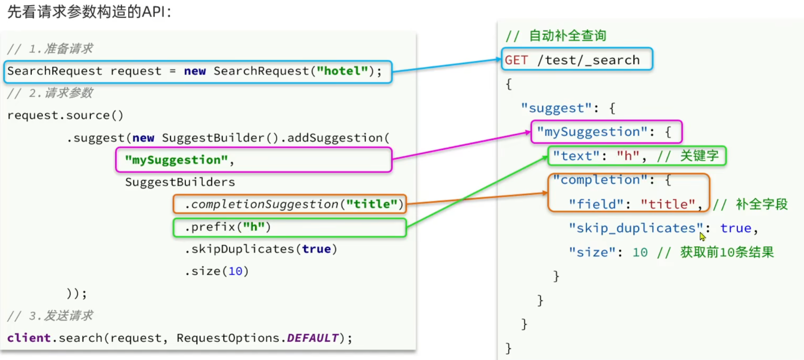

#  SpringCloud

- 单体架构：将业务的所有功能集中在一个项目中开发并打包部署

- 分布式架构：根据业务功能对系统进行拆分，每个业务模块作为独立的项目开发，称为一个服务
  - 降低耦合
  - 利于服务升级拓展
  
- 服务拆分

  - 每个服务为一个模块，对外暴露接口，服务之间通过远程调用

  - 远程调用：基于RestTemplate发起的http请求实现远程调用

    - 在启动配置类中创建RestTemplate并注入spring容器

    - ```
          @Bean
          public RestTemplate restTemplate(){
              return new RestTemplate();
          }
      ```

    - 通过发送http请求获取数据

    - ```
      String url = "http://"
      User user = 
      ```

## Eureka

- EurekaServer：服务端，注册中心
  - 记录服务信息
  - 心跳监控
- EurekaClient：客户端
  - 服务提供者
    - 注册自己的信息到EurekaServer注册中心
    - 每隔30s向注册中心发送心跳
  - 服务消费者
    - 基于服务名称向EurekaServer拉去服务列表
    - 负载均衡

### 搭建与使用

- 搭建

  - 创建新模块，引入依赖`spring-cloud-starter-netflix-eureka-server`

  - 编写启动类，添加`@EnableEurekaServer`注解

  - 编写配置文件
    ```
    server:
      port: 10086 
    spring:
      application:
        name: eurekaserver #eureka的服务名称
    eureka:
      client:
        service-url:
          defaultZone: http://127.0.0.1:10086/eureka/ #euraka地址信息
    ```

- 服务注册

  - 在服务项目中添加依赖`spring-cloud-starter-netflix-eureka-client`
  - 编写配置文件（服务名称和地址信息）

- 服务发现

  - 修改访问路径，用服务名称代替ip端口例如`http://userservice/user/`

  - 在启动类中的RestTemplate添加负载均衡注解
    ```
        @Bean
        @LoadBalanced
        public RestTemplate restTemplate(){
            return new RestTemplate();
        }
    ```


### Ribbon

- Ribbon负载均衡原理需要看视频

- Ribbon负载均衡策略是一个交IRule的接口来定义的，每一个子接口都是一种规则

  - 默认使用`ZoneAvoidanceRule`规则，以区域可用的服务器为基础做轮询

  - 修改负载均衡规则

    - 在启动类中配置新的IRule
      ```
      @Bean
      public IRule randomRule(){
      	return new RandomRule();
      }
      ```

    - 配置文件

- Ribbon默认采用懒加载，第一次访问时才会去创建LoadBalanceClient，请求时间会很长。

  - 配置开启饥饿加载，降低第一次访问的耗时
    ```
    ribbon:
      eager-load:
        enabled: true #开启饥饿加载
        clients:
          - userservice #指定服务名称
          - xxservice
    ```

## Nacos

Nacos是阿里巴巴的产品，现在是SpringCloud中的一个组件。相比Eureka功能更加丰富，在国内受欢迎程度较高。

### 快速入门

- 默认端口8848，在conf文件夹中的application配置文件中修改默认端口

- 进入bin目录启动命令：`startup.cmd -m standalone`(单机模式)

  - 账号和密码都是nacos

- 使用

  - 在spring-cloud父工程中添加spring-cloud-alilbaba的管理依赖
    ```
       <dependency>
             <groupId>com.alibaba.cloud</groupId>
             <artifactId>spring-cloud-alibaba-dependencies</artifactId>
             <version>2.2.5.RELEASE</version>
             <type>pom</type>
             <scope>import</scope>
       </dependency>
    ```

  - 修改服务器和客户端的依赖
    ```
    <dependency>
        <groupId>com.alibaba.cloud</groupId>
        <artifactId>spring-cloud-starter-alibaba-nacos-discovery</artifactId>
    </dependency>
    ```

  - 修改配置文件
    ```
    spring:
    	cloud:
    		nacos:
    			server-addr: localhost:8848 #nacos服务地址
    ```

### 服务调用

- 服务多级存储模型

  - 一级是服务，例如userservice
  - 二级是集群，例如上海
  - 三级是实例，例如上海某台部署了userservice的服务器

- 服务调用尽可能使用本地集群的服务，跨集群调用延迟较高

  - 设置集群属性：修改application配置文件中的`spring.cloud.nacos.discovery.cluster-name`属性即可

  - 在客户端配置文件中修改负载均衡的IRule，优先选择同集群的服务实例
    ```
    userservice: #要做配置的服务名称
      ribbon:
        NFLoadBalancerRuleClassName: com.alibaba.cloud.nacos.ribbon.NacosRule #负载均衡规则
    ```

- 权重控制

  - nacos控制台可以设置实例的权重，0~1之间，权重越高被访问的频率越高
  - 权重为0的实例将不会被访问

- 环境隔离
  - namespace用来做环境隔离，每个namespace都有唯一id
  - 不同namespace下的服务不可见
  - 配置：
    - 在nacos控制台新建一个namespace，并得到它的id
    - 进入对应服务的配置文件，和集群同一级别的属性namespace配置id

### 对比Eureka

- Nacos支持服务端主动检测提供者状态（非临时实例），临时实例还是采用心跳模式
- 临时实例心跳不正常会被剔除，非临时实例不会被剔除
- Nacos支持服务列表变更的消息推送模式，更新很及时
- Nacos集群默认采用AP方式，当集群中存在非临时实例时，采用CP模式;Eureka采用AP方式

### 配置管理

- 在Nacos控制台中统一配置
  - 在配置管理中添加配置
  - 填写表单中的配置信息：配置文件id`[服务名称]-[环境].[后缀名]`、分组、配置内容

- 配置拉取
  - 引入Nacos的配置管理客户端依赖
  - 在resource目录添加一个bootstrap.yml文件，这个文件是引导文件，优先级高于application.yml
    - 配置nacos地址、当前环境、服务名称、后缀名


- 配置热更新
  - 通过@Value注解注入，结合@RefreshScope来刷新
  - 通过@ConfigurationProperties注入，自动刷新
- 多环境配置
  - `[服务名].yaml`，默认配置，多环境共享
  - 优先级：`[服务名称]-[环境].yaml > [服务名称].yaml] > 本地配置`

## Feign

- Feign是一个声明式的http客户端，帮助我们发送http请求，用Feign代替RestTemplate来发起远程调用

- 使用步骤

  - 引入依赖

  - 配置启动类添加@EnableFeignClients注解

  - 编写FeiginClient接口（基于SpringMVC的注解来声明）

    ```
    @FeignClient("userservice")
    public interface UserClient{
    	@GetMapper("/user/{id}")
    	User findById(@PathVariable("id") Long id);
    }
    ```

  - 使用FeiginClient中定义的方法代替RestTemplate

- 自定义配置
  - 通过配置文件
  - 通过java代码
  - 配置日志文件级别、响应结果（json转对象）、请求参数编码、支持的注解格式（SpringMVC）、失败重试机制

- 优化
  - 日志级别尽量用basic
  - 使用HttpClient或OKHttp代替URLConnection（无连接池）
    - 引入feign-httpClient依赖
    - 配置文件开启httpClient功能，设置连接池参数

- 最佳实践
  - 让controller（服务端）和FeignClient（客户端）继承同一接口、
  - 将FeignClient、POJO、Feign的默认配置都定义到一个项目中，供所有消费者使用
    - 不同包的FeignClient的导入有两种方式:
      - 在@EnableFeignclients注解中添加basePackages，指定FeignClient所在的包
      - 在@EnableFeignClients注解中添加clients，指定具体FeignClient的字节码

## Gateway网关

# Docker

### 基本概念

- Docker是一个快速交付应用、运行应用的技术:
  - 可以将程序及其依赖、运行环境一起打包为一个镜像，可以迁移到任意Linux操作系统
  - 运行时利用沙箱机制形成隔离容器，各个应用互不干扰
  - 启动、移除都可以通过一行命令完成，方便快捷
- 镜像：将应用程序及其依赖、环境、配置打包在一起
- 容器：镜像运行起来就是容器，一个镜像可以运行多个容器
- 与虚拟机的区别：
  - 只需要Linux内核就能操作，因为镜像中同时也打包了需要操作内核的函数库，直接操作内核
  - docker是一个系统进程，体积小、速度快、性能好

- Docker结构：
  - 服务端：接收命令或远程请求，操作镜像容器
  - 客户端：发送命令或者请求到Docker服务端
- DockerHub：
  - 一个镜像托管的服务器，类似的还有阿里云镜像服务，统称为DockerRegistry，可以像maven一样拉取镜像

### 安装

- 卸载老版本
  ```
  yum remove docker \
                    docker-client \
                    docker-client-latest \
                    docker-common \
                    docker-latest \
                    docker-latest-logrotate \
                    docker-logrotate \
                    docker-engine
  ```

- 安装yum工具包
  ```
  yum install -y yum-utils
  ```

- 配置仓库源
  ```
   yum-config-manager \
      --add-repo \
      https://mirrors.ustc.edu.cn/docker-ce/linux/centos/docker-ce.repo
  ```

- 安装：`yum install docker-ce docker-ce-cli containerd.io`

### 命令

- 镜像名称：`[repository:tag]`，在没有指定tag时，默认是最新版本`mysql:latest`

- 可以去DockerHub中查看对应镜像的相关命令

- 镜像命令
  - `docker --help`获取查看所有命令，或者`docker xx --help`获取这个命令的语法
  - `docker images`、`docker rmi`、`docker pull`、`docker push`、`docker save`、`docker load`

- 容器命令

  - 创建并运行一个容器：`docker run --name mn -p 80:80 -d nginx`
    - name名字，- p主机端口和容器端口的映射关系（左侧是主机端口），-d后台运行
  - 容器有三种状态：运行、暂停、停止
    - `docker pause`、`docker unpause`，暂停
    - `docker start`、`docker stop`，停止

  - `docker ps`查看所有容器信息、`docker logs [容器名]`查看容器的日志、`docker rm -f [容器名]`强制删除容器
  - `docker exec -it [容器名] [要执行的命令]`进入容器修改内文件

- 数据卷命令
  - 数据卷是将容器的数据与宿主主机的硬盘文件数据进行双向数据绑定，方便操作容器内的数据
  - `docker volume [命令] --help`
    - create创建数据卷，docker inspect id显示一个或多个数据卷信息，ls列出所有，prune删除未使用，rm删除指定
  - 挂载：
    - 容器创建时通过-v参数：`docker run --name mn -p 80:80 -v html:/usr/share/nginx/html -d nginx` 
    - 容器运行时：`docker container mount container_id:/host/path /container/path`

### 自定义镜像

- 镜像结构
  - 镜像是分层结构，每一层称为一个Layer
  - Baselmage层:包含基本的系统函数库、环境变量、文件系统
  - Entrypoint: 入口，是镜像中应用启动的命令
  - 其它:在Baselmage基础上添加依赖、安装程序、完成整个应用 安装和配置

- 编写Dockerfile：关键词：FROM、ENV、COPY、RUN、EXPOSE、ENTRYPOINT
  ```0
  #指定基础镜像
  FROM ubuntu:16.04
  #配置环境变量
  ENV JAVA_DIR=/user/local
  #拷贝JDK和Java项目的包
  COPY ./jdk8.tar.gz $JAVA_DIR/
  COPY ./docker-demo.jar /tmp/app.jar
  #安装JDK(RUN：执行Linux命令)
  RUN cd $AVA_DIR \
  && tar -xf ./jdk8.tar.gz \
  && mv ./jdk1.8.0_144 ./java8
  #配置环境变量
  ENV JAVA_HOME=$JAVA_DIR/java8
  ENV PATH=$PATH:$JAVA_HOME/bin
  #暴露端口
  EXPOSE 8090
  #入口，启动命令
  ENTRYPOINT java -jar /tmp/app.jar
  ```

  - 第一行必须是FROM
  - 基础镜像可以是基本操作系统，也可以是其他人制作的镜像
  - 基于他人的镜像进行构建会更加简单，比如java:8-alpine不用配置jdk
  
- 构建镜像：
  `````
  docker build -t ubuntu:1.0.0 . # 后面有一个"点"
  `````

  - `-t myubuntu:1.0.0`，指定构建的镜像的名称为myubuntu，同时设置版本标签为 1.0.0；
  - `.` ：这个参数指定了 `Dockerfile` 所在的路径

### DockerCompose

- Docker Compose可以基于Compose文件帮我们快速的部署分布式应用，而无需手动一个个创建和运行容器
- Compose文件是一个文本文件，通过指令定义集群中的每个容器如何运行。
- BUG：nacos启动较慢导致其他服务启动失败
- 镜像仓库
  - 镜像仓库推送前需要把仓库地址配置到docker服务的daemon.json文件中，被docker信任
  - 推送本地镜像到仓库前都必须重命名(`docker tag`)镜像，以镜像仓库地址为前缀
  - 推送`docker push`，拉取`docker pull`

# MQ消息队列

### RabbitMQ

- 概念
  - channel：操作MQ的工具
  - exchange：路由消息到队列中
  - queue：缓存消息
  - virtual host：虚拟主机，是对queue、exchange等资源的逻辑分组

- 简单队列
  - 基本消息队列的消息发送流程:
    - 1．建立connection
    - 2．创建channel
    - 3．利用channel声明队列
    - 4．利用channel向队列发送消息
  - 基本消息队列的消息接收流程:
    - 1．建立connection
    - 2．创建channel
    - 3．利用channel声明队列
    - 4．定义consumer的消费行为handleDelivery()，回调且异步
    - 5．利用channel将消费者与队列绑定

### SpringAMQP

- 概念

  - AMQP是用于在应用程序或之间传递业务消息的开放标准。该协议与语言和平台无关，更符合微服务中独立性的要求。

  - SpringAMQP是基于AMQP协议定义的一套API规范，提供了模板来发送和接收消息。包含两部分，其中spring-amqp是基础抽象，spring-rabbit是底层的默认实现。

- 简单使用

  - 父工程引入依赖`spring-boot-starter-amqp`（包含rabbitMQ）

  - 编写application配置信息
    ```     
    spring:
    	rabbitmq:
    		host:
    		port:
    		username:
    		password:
    		virtual-host: /
    ```
    
  - 消息发送：利用依赖注入的RabbitTemplate的convertAndSend方法
  
  - 消息接收：新建一个类（@Component)，编写消费逻辑（@RabbitListener(queues = "simple.queue" )），消息=传入参数
  
- WorkQueue模型

  - 多个消费者绑定一个队列，同一条消息只会被一个消费者处理
  - 消息预取机制：大量消息到达队列时，多个消费者会提前拿到消息（平均）再一个个处理，避免消息堆积
  - 通过配置文件可以更改预取消息的数量`spring:rabbitmq:listener:simple:prefetch:1`

### 交换机

- FanoutExchange

  - 接收publisher发送的消息，并将其路由到每个绑定的队列

  - 不能缓存消息，路由失败，消息丢失

  - 声明：
    ```
    @Configuration
    public class FanoutConfig{
    	// 声明FanoutExchange交换机
    	@Bean
    	public FanoutExchange fanoutExchange(){
    		return new FanoutExchange("itcast.fanout" );
    	}
    	//声明第一个队列
    	@Bean
    	public Queue fanoutQueue1(){
    	 	return new Queue("fanout.queue1");
    	}
    	//交换机和队列1的绑定
    	@Bean
    	public Binding bindingQueue1(Queue fanoutQueue1，FanoutExchange fanoutExchange){
    		return BindingBuilder.bind(fanoutQueue1).to(fanoutExchange);
    	}
    	// 。。。声明第二个队列并绑定
    }
    ```

- DirectExchange

  - 将接收到的消息根据规则路由到指定的Queue

    - 每一个Queue都与Exchange设置一个BindingKey
    - 发布者发送消息时，指定消息的RoutingKey
    - Exchange将消息路由到BindingKey与消息RoutingKey一致的队列

  - 基于@RabbitListener注解声明：
    ```
    @RabbitListener(bindings =@QueueBinding(
    		value = @Queue(name = "direct.queue1"),
    		exchange = @Exchange(name = "itcast.direct", type = ExchangeTypes.DIRECT),
    		key = { "red", "blue"}
    )
    public void listenDirectQueue1(String msg){
    	system.out.println("消费者1接收到Direct消息:【"+msg+"】");
    }
    ```

- TopicExchange

  - TopicExchange与DirectExchange类似，区别在于routingKey必须是多个单词的列表，并且以`.`分割。
  - Queue与Exchange指定BindingKey时可以使用通配符：
    - `#`：代指0个或多个单词
    - `*`：代指一个单词
  - 示例：`china.news`、`china.weather`、`china.#`
  - 使用和DirectExchange差不多，改一下交换机的类型和key

- 消息转换器

  - 消息可以是任何类型（Object），通过序列化和反序列化进行传递

  - 利用MessageConverter实现的，默认是JDK的序列化

  - 注意发送方与接收方必须使用相同的MessageConverter

  - 修改序列化方式为Json

    - 引入json依赖`jackson-dataformat-xml`

    - 启动类配置依赖注入
      ```
      @Bean
      public MessageConverter messageConverter(){
      	return new Jackson2JsonMessageConverterO;
      }
      ```

    - 传入参数类型和消息类型保持一致

# 分布式搜索

### ES

- 概念

  - elasticsearch是一个开源的分布式搜索引擎，可以用来实现搜索、日志统计、分析、系统监控等功能

  - 是以elasticsearch为核心的技术栈，包括beats、Logstash、kibana、elasticsearch
    - 数据可视化：Kibana
    - 存储、计算、搜索数据：lasticsearch
    - 数据抓取：Beats、Logstash
  - Lucene：是Apache的开源搜索引擎类库，提供了搜索引擎的核心API，elasticsearch基于Lucene实现的

- **倒排索引**

  - 文档 ：每条数据就是一个文档
  - 词条：文档按照语义分成的词语
  - 对文档内容分词，对词条创建索引，并记录词条所在文档的信息（id）。
  - 查询时先根据词条查询到文档id，而后获取到文档

- 结构

  - es是面向文档存储的，可以是数据库中的一条信息
    - Index（索引）：文档的集合，类似数据库中的表
    - Document（文档）：一条条数据，类似于数据库中的行，json格式
    - Field（字段）：就是json文档中的字段，类似于数据库的列
    - Mapping（映射）：索引中文档的约束，例如字段类型约束
    - DSL：json风格的CRUD
  - 数据库负责事务类型的操作
  - es负责海量数据的搜索、分析、计算

- IK分词器

  - 分词器的作用：

    - 创建倒排索引时对文档分词
    - 用户搜索时，对输入的内容分词

  - 标准的分词不适用于中文，使用开源的IK分词器，下载解压到es的plugin数据卷中

  - `ik_smart`：最少切分。`ik_max_word`：最细切分

  - 拓展分词和停用分词

    - 修改IK分词器目录中的config目录中的lkAnalyzer.cfg.xml文件
      ```
      <!--用户可以在这里配置自己的扩展字典-->
      <entry key= "ext_dict">ext.dic</entry>
      <! --用户可以在这里配置自己的扩展停止词字典***添加停用词词典-->
      <entry key="ext_stopwords">stopword.dic</entry>
      ```

    - 在当前目录文件中编写ext.dic和stopword.dic文件，加入扩展词语和停用词语

### 索引库

- mapping是对索引库中文档的约束，常见的mapping属性包括

  - type：字段数据类型，常见的简单类型有：
    - 字符串: text (可分词的文本) 、keyword（精确值，例如:品牌、国家、ip地址)
    - 数值:long.integer、short、byte、double、float
    - 布尔：boolean
    - 日期：date
    - 对象：object
  - index：是否创建倒排索引，默认为true，不需要进行搜索的不需要索引
  - analyzer：使用哪种分词器
  - properties：该字段的子字段

- 操作索引库

  - 创建索引库
    ```
    PUT /索引库名称
    {
    	"mapping": {
    		"propertier": {
    			"info": {
    				"type": "text",
    				"analyzer": "ik_smart"
    			},
    			"email": {
    				"type": "keyword",
    				"index": false
    			},
    			"name": {
    				"type": "object",
    				"properties": {
    					"firstname": {
    						"type": "keyword"
    					}
    				}
    			}
    		}
    	}
    }
    ```

  - 查看索引库：`GET /索引库名称`

  - 删除索引库：`DELETE /索引库名称`

  - 修改索引库：

    - 索引库和mapping一旦创建就无法修改，但是可以添加新的字段

    - ```
      PUT /索引库名/_mapping
      {
      	"properties":{
      		"新字段": {
      			"type":
      		}
      	}
      }
      ```

- 文档操作

  - 新增：
    ```
    POST /索引库名/_doc/文档id
    {
    	"字段1": "值1",
    	...
    }
    ```

  - 删除：`DELETE /索引库名/_doc/文档id`

  - 查询：`GET /索引库名/_doc/文档id`

  - 修改：

    - 全量修改：`PUT /索引库名/_doc/文档id{ json文档 }`，没有找到文档id就是新增
    - 局部修改： `POST /索引库名/_doc/文档id{ "doc" : { "字段": "新值" } }`

### RestClient

- ES中支持两种地理坐标数据类型

  - `geo_point:`由经纬度确定，两个子字段
  - `geo_shape:`由多个geo_point构成的几何图形

- 字段拷贝

  - 使用`"copy_to": `属性可以将当前字段拷贝到指定字段
  - 将多个字段拷贝到某一个字段中创建索引，即可实现多字段同时查询

- JavaRestClient操作索引库

  - 导入依赖`elasticsearch-rest-high-level-client`

  - springboot管理的依赖版本需要在properties中修改es的版本

  - 初始化
    ```
    RestHighLevelclient client = new RestHighLevelclient(RestClient.builder(
    	HttpHost.create( "http://192.168.150.101:9200")//可以添加多个
    ));
    client.close;
    ```

  - 操作索引库

    - 创建索引库
      ```
      //1.创建Request对象
      CreateIndexRequest request = new CreateIndexRequest("hotel");
      //2.请求参数，MAPPING_TEHPLATE是静态常量字符串，内容是创建索引库的DSL语句
      request.source(MAPPING_TEMPLATE，XContentType.JSON);
      //3.发起请求
      client.indices().create(request,Request0ptions.DEFAULT);
      ```

    - 索引库操作的基本步骤

      - 初始化RestClient
      - 创建XXXIndexRequest
      - 准备DSL
      - 发送请求：调用RestHighLevelClient#indices().xxx()方法

- JavaRestClient操作文档

  - 基本步骤
    ```
    Hotel hotel = hotelService.getById(61083L);
    //转换为文档类型
    HotelDoc hotelDoc = new HotelDoc(otel);
    //1.准备Request对象
    IndexRequest request = new IndexRequest("hotel").id(hotel.getId().toString());
    //2.准备Json文档
    request.source(JSON.toJSONString(hotelDoc)，XContentType.JSON);
    //3.发送请求
    client.index (request, Request0ptions.DEFAULT);
    ```

  - 查询文档：

    - 准备GetRequest，索引库名和文档id
    - 发送请求得到响应（GetResponse）
    - 解析响应结果`String json = response.getSourceAsString();`

  - 更新文档：

    - 局部更新：
      ```
      request.doc(
      	"price", "952",
      	"starName", "四钻"
      )
      ```

  - 批量导入文档
    ```
    //1.创建Request
    BulkRequest request = new BulkRequest();
    //2.准备参数，添加多个新增的Request,在此处使用循环遍历从而实现批量导入
    request.add(new IndexRequest("hotel").id("61038"). source("json"，XContentType.JSON));
    request.add(new IndexRequest("hotel").id("61038"). source("json"，XContentType.JSON));
    //3.发送请求
    client.bulk(request, Request0ptions.DEFAULT)
    ```


### DSL查询

- 基本语法
  ```
  GET/索引库名/_search
  { "query" : { "查询类型": { "FIELD": "TEXT"}}}
  ```

- 查询所有：`match_all`

- 全文检索查询：`match`

- 多字段查询：`{ "multi_match":{ "query": "TEXT" "fields": ["fields1", "fields2"] }}`

- 精确查询：查询不需要分词的字段例如keyword

  - `term`：`"term": { "FIELD": { "value": "TEXT"}}`
  - `range`：`"range": { "FIELD": { "gte": "10" "lt": "20" }}`大于等于10小于20

- 地理查询：
  - `geo_bounding box`：查询geo_point值落在某个矩形范围的所有文档
  - `geo_distance`:查询到指定中心点小于某个距离值的所有文档

- 相关性打分算法
  - 可以控制文档相关性算分，控制文档排名
  - TF-IDF:在elasticsearch5.0之前，会随着词频增加而越来越大
  - BM25:在elasticsearch5.0之后，会随着词频增加而增大，但增长曲线会趋于水平
- Function Score Query
  

- Boolean Query

  - 多个查询条件的组合
    ```
    {
    	"query": {
    		"bool": {
             "must": [
                {"term":{"city": "上海"}}
                ]，
             "should": [],
             "must_not": [],
             "fiter": []
          }
    	}
    }
    ```
    
  - must：必须匹配（与），should：选择性匹配（或），must_not：必须不匹配（非），filter：必须匹配但是不参与算法

- 结果处理

  - 排序
    ```
    {
    	"query": {
    		"match_all": {}
    	},
    	"sort": [
    		{"score": "desc"}.//先按评价降序
    		{"price": "asc"}//相同的按价格升序
    		{
    			"_geo_distance" : {//经纬度排序
    				"location" : {
                   "lat" : 31.034661,
                   "lon" : 121.612282
                },
                "order" : "asc",
                "unit" : “km" //以km为到位
    			}
    		}
    	]
    }
    ```

  - 分页

    - `"from": 999, "size": 10`：支持随机分页，from表示分页开始的位置，size表示每页文档数，查询上限1w
    - aftersearch：只能逐后翻页，没有查询上限
    - scroll：缓存，额外内存消耗

  - 高亮
    ```
    "hightlight": {
    	"fields": { //需要高亮的字段
    		"name": {
    			"pre_tag": "<em>", //前置和后置标签，默认高亮
    			"post_tag": "</em>",
    			"require _field match": "false"//不需要和搜索字段一样
    		}
    	}
    }
    ```

### Client查询

- 基本语法
  ```
  //1.准备Request
  SearchRequest request = new SearchRequest("hotel");
  //2.准备DSL
  request.source().query(QueryBuilders.matchAllQuery());
  //3.发送请求
  SearchResponse response = client.search(request，Requestoptions.DEFAULT);
  //4.解析响应
  searchHits searchHits = response.getHits();
  //4.1.获取总条数
  long total = searchHits.getTotalHits( ).value;
  System.out.println("共搜索到" + total +"条数据");
  //4.2.文档数组
  SearchHit[] hits = searchHits.getHits( );
  //4.3.遍历
  for (SearchHit hit : hits) {
  	//获取文档source
  	string json = hit.getSourceAsString();
  }
  system.out.println( response) ;
  ```

- 检索查询
  ```
  //单字段查询
  QueryBuilders.matchQuery("all"，"如家");
  //多字段查询
  QueryBuilders.multiMatchQuery("如家"，"name"，"business") ;
  ```

- 精确查询
  ```
  //词条查询
  QueryBuilders.termQuery("city""杭州");
  //范围查询
  QueryBuilders.rangeQuery("price").gte(100).lte(150);
  ```

- 布尔查询
  ```
  BoolQueryBuilder boolQuery = QueryBuilders.boolQuery();
  boolQuery.must(QueryBuilders.termQuery("city","杭州"));
  boolQuery.filter(QueryBuilders.rangeQuery("price").lte(250));
  ```

- 排序、分页和高亮
  ```
  request.source().sort("price",SortOrder.ASC);
  //经纬度排序
  String location = params.getLocation;
  request.source().sort(sortBuilders
  	.geoDistanceSort("location",newGeoPoint(location))
  	.order(SortOrder.AsC)
  	.unit(DistanceUnit.KILOMETERS)
  );
  //排序后与目标的距离就是sort值
  object[] sortValues = hit.getSortValues( );
  //分页
  request.source().from((page -1)*size).size(5);
  //高亮
  request.source().highlighter(new HighlightBuilder().field("name").requireFieldMatch(false));
  //高亮结果处理
  Map<String，HighlightField> highlightFields =hit.getHighlightFields();
  if (!collectionUtils.isEmpty(highlightFields)) {
  	//获取高亮结果字段
     HighlightField highlightField = highlightFields.get("name");
     if (highlightField != null) {
     	//取出高亮结果数组中的第一个
     	String name = highlightField.getFragments()[0].string();
     	hotelDoc.setName (name);
  }}
  ```

- 算分控制
  ```
  FunctionScoreQueryBuilder functionScoreQuery =
  	QueryBuilders.functionScoreQuery(
  		//原始查询，相关性算分的查询
  		boolQuery,
  		// function score的数组
  		new FunctionScoreQueryBuilder.FilterFunctionBuilder[]{
  			//其中的一个function score元素
  			new FunctionScoreQueryBuilder.FilterFunctionBuilder(
  				//过滤条件
  				QueryBuilders.termQuery ( name: "isAD" ,value: true),
  				//算分函数
  				scoreFunctionBuilders.weightFactorFunction(10)
  			)
  		});
  ```


### 聚合

- DSL
  ```
  {	"query":{ ... }  //	限定聚合的文档范围
  	"size": 0,	//结果中不包含文档，只包含聚合结果
  	//Bucket聚合
  	"aggs": { 	//定义聚合
  		"brandAgg ": {	//自定义聚合名称
  			"terms" : { //聚合类型，精准匹配
  				"field" : "brand", //参与聚合的字段
  				"size": 20	//希望获取聚合结果数量
  				"order":{
  					"_count": "asc" //指定聚合结果的排序方式
  				}
  			},
  			//Metics聚合，嵌套在内
  			"aggs": { 				//是brands聚合的子聚合，也就是分组后对每组分别计算
  				"score_stats": {  //聚合名称
  					"stats" : { 	//聚合类型，这里stats可以计算min、max、avg等
  						"field" : "score" //聚合字段，这里是score
  					}
  				}
  			}
  		}
  }
  ```

- Client
  

### 自定义分词器

- 分词器

  - 拼音分词器：和ik分词器一样下载解压到es的plugin目录

  - 分词器分为三个部分：

    - character filters：在tokenizer之前对文本进行处理。例如删除字符、替换字符
    - tokenizer：将文本按照一定的规则切割成词条(term)。例如keyword，就是不分词;还有ik_smart
    - tokenizer filter：将tokenizer输出的词条做进一步处理。例如大小写转换、同义词处理、拼音处理等

  - 自定义分词器

    - 我们可以在创建索引库时，通过settings来配置自定义的analyzer(分词器)
      ```
      {
      	"settings": {
      		"analysis": {
      			"analyzer": { 			//自定义分词器
      				"my_analyzer": {	//分词器名称
      					"tokenizer" : "ik_max_word" ,
      					"fiiter" : "py"
      				}
      			},
      			"filter" : { 	//自定义tokenizer filter
      				"py" : { 	//过滤器名称
      					"type" : "pinyin", //过滤器类型，这里是pinyin
      					//以下是拼音分词器的相关配置更改
      					"keep_full_pinyin" : false,
      					"keep_joined_full_pinyin": true,
      					"keep_original" : true,
      					"limit_first_letter_length": 16,
      					"remove_duplicated_term" : true,
      					"none_chinese_pinyin_tokenize" : false
      				}
      			}
      		}
      	}
      	//字段在创建倒排索引时应该用my_analyzer分词器;字段在搜索时应该使用ik_smart分词器
      	"mappings": {
      		"properties": {
      			"name": {
      				"type" : "text",
      				"analyzer": "my_analyzer",
      				"search_analyzer": "ik_smart"
      			}
      		}
      	}
      }
      ```


### 自动补全

- 参与补全查询的字段必须是completion类型。
- 字段的内容一般是用来补全的多个词条形成的数组。

```
{
	"suggest": {
		"title_suggest": {
			"text": "s",//关键字
			"completion": {
				"field" : "title",//补全查询的字段
				"skip_duplicates": true,//跳过重复的
				"size": 10 //获取前10条结果
			}
		}
	}
}
```




# Ngnix

## 介绍

- 目录结构
  - nginx
    - conf：配置文件，其中nginx.conf是主配置文件，其他的都是被其引用
    - html：默认情况下访问的网页和静态资源
    - logs：访问日志、错误日志和线程id
    - sbin：nginx主程序
- 多进程模型（并非多线程）
  - master进程：一个主进程，负责管理worker进程
    - 本身不处理业务
    - 当woker进程退出后（异常情况下），会自动重新启动新的woker进程。
    - 当配置文件更改时，向老的worker进程发信号，处理完当前请求就自杀
  - worker进程：主要用来处理基本的网络事件
    - 多个worker进程之间是对等且相互独立的，他们同等竞争来自客户端的请求。
    - 一个请求，只可能在一个worker进程中处理。
    - worker进程的个数是可以设置的，一般我们会设置与机器cpu核数一致。

## 配置文件解析

```
# 运行用户
user  nginx;
# Nginx 进程, 一般设置与CPU核心数相等
worker_processes  1;
# 错误日志路径
error_log  /var/log/nginx/error.log;
# 访问日志路径
access_log  /var/log/nginx/access.log;
# 事件配置
events {
    worker_connections  1024; # 每个进程允许最大连接数
}
# HTTP 服务器配置
http {
    # 包含文件扩展名与文件类型映射
    include       /etc/nginx/mime.types;
    default_type  application/octet-stream; # 默认文件类型
    #传送文件的时候，通常nginx需要从磁盘读取到自己的内存再从内存复制发送到接口中，开启这个可以让nginx发送信号给内核，让内核直接读取发送到接口，前者会多一层io
    sendfile        on;
    
     #长连接超时时间，单位是秒
    keepalive_timeout  65;
    # 服务器配置
    server {
        listen       80; # 监听的端口
        server_name  localhost; # 服务器名或域名
 
        # 路由，'/'表示默认请求处理
        location / {
            root   /usr/share/nginx/html; # 文件根目录
            index  index.html index.htm; # 默认页面
        }
        # 定义错误处理页面的文件位置
        #error_page   500 502 503 504  /50x.html;
        #location = /50x.html {
        #}
    }
}

```

## 虚拟主机和域名配置

- 泛解析
  - 当你注册了一个域名（`ytr.com`）之后，你可以为它可以添加二级域名，即`www.ytr.com`，也是主机记录（默认www）
  - 当你设置了主机记录为www时。你输入的网址不是www开头就不会被DNS解析
  - 而泛解析`*.ytr.com`，可以将所有带有`ytr.com`后缀的域名解析到你的ip

- 基于ip
  - 在配置文件中，两个server监听的ip地址不同
  - 适用于一个服务器上拥有多个 IP 地址，每个 IP 地址对应一个不同的网站。
  - 但是在公网中，一台服务器只有一个ip地址（唯一标识），所以只适用于内网
- 基于端口
  - 在配置文件中，两个server监听的端口不同
  - 比较常见，就是不同的端口访问不同的文件目录
- 基于域名（主机名）
  - 在配置文件中，两个server监听的端口相同，但是主机名（域名）不同
  - 适用于一个服务器上拥有多个域名，每个域名对应一个不同的网站。
  - 可以搭配二级域名（泛解析）使用

- 域名解析实战

  - 多用户二级域名：使用泛解析，让nginx反向代理到后端，后端根据域名的头部从数据库取信息
  - 短网址：也是nginx反向代理到后端，根据尾部信息（`.com`之后的路由），从数据库取出真实地址，并使用键值对返回并重定向

  - HttpDns：适用于C/S架构，app启动时发送请求到服务器，从服务器中拿到ip地址并保存

## 反向代理和负载均衡

- 正向代理

  - 你使用手机wifi访问网站就是正向代理
  - 路由和几个用户在同一个内网之下，由路由器做代理服务器，将你的请求正向代理到网站上

- 反向代理

  - 你的tomcat服务器不能被直接访问，但是nginx和tomcat处于同一个内网上

  - 当你想要访问tomcat时，只需要向nginx发请求，nginx将请求反向代理到tomcat服务器上做响应并返回

  - 写法：
    ```
    server {
            listen       80; # 监听的端口
            server_name  localhost; # 服务器名或域名
            location / {
              proxy_pass http://www.qq.com; #反向代理地址
            }
        }
    ```

  - 当你的反向代理地址填错了，会报错302，并且nginx会将代理变成转发（就是nginx不管了）

- lvs

  - 正向代理还是反向代理都被称为隧道式代理，请求和响应都需要经过代理服务器
  - 隧道式代理出现大文件的下载和上传时，nginx就可能扛不住
  - lvs可以在反向代理时，让tomcat的响应直接传回用户，不需要经过nginx

- 负载均衡

  - 适用于服务器集群的情况，即有几个相同业务的服务器，为了防止服务器宕机或者提高业务性能

  - 让请求按照算法在这几个服务器之间分发

  - 算法：轮询就是每个服务器一个请求，顺序执行

  - 写法：
    ```
    	 upstream httpds{ 	#负载均衡ip地址
    	 	  server 192.168.44.102:80 weight=8 down;
    	 	  server 192.168.44.103:80 backup;
    	 }
        server {
            listen       80; # 监听的端口
            server_name  localhost; # 服务器名或域名
            location / {
    				proxy_pass http://httpds; #起别名
            }
        }
    ```

  - 负载均衡策略：`weight=8`：权重，`down`：宕机，`backup`：备用

## 动静分离

- 介绍

  - 传统的项目静态资源被存放在tomcat服务器的web-inf目录下，在使用nginx代理的时候，静态资源也需要通过代理到tomcat服务器中获取

  - nginx的动静分离可以将静态资源放入nginx中，当请求路径为静态资源时被匹配到nginx的目录
  
  - 写法：这种写法属于伪后端（访问tomcat的uri在nginx中被捕捉）
    ```
    server {
       listen       80; # 监听的端口
       server_name  localhost; # 服务器名或域名
       location / {
       	proxy_pass http://httpds; #起别名
       }
       location ~*/(js|img|css){  #location的配置可以使用正则表达式
       	root html;
       	index  index.html index.htm; 
       }
    }
    ```
  
- 伪静态Rewrite

  - 相当于uri的映射，在nginx中，uri如果在Rewrite中被匹配，反向代理的时候uri就会被Rewrite改变，跟重定向类似

  - 写法：
    ```
     location / {
     		rewrite ^/([O-9]+).html$ /index.jsp?pageNum=$1 break; #正则表达式匹配，$1就是取正则匹配的第一个参数
       	proxy_pass http://192.168.44.102:8080; 
       }
    ```

  - `breck`终止、`last`继续向下匹配、`redirect`返回302临时重定向、`permanent`返回301永久重定向

- 防盗链

  - 请求头Referer表示这次请求的来源，比如访问一个html页面时引用了css，则需要再发送请求来获取css，这个时候请求头Referer就会带上访问的html页面的地址（域名）

  - 当你不想让其他人随便请求到你的静态资源（图片什么的），就可以设置防盗链检测请求头Referer是否正确

  - 写法：
    ```
    location ~*/(js|img|css){  #location的配置可以使用正则表达式
    		#这里需要填写域名而不是ip,none表示没有referer也可以访问，blocked表示需要http:://这样的开头
    		#server_names可以匹配多个域名
    		valid_referers (none|blocked|server_names) 192.168.44.102 
    		if($invalid_referer){
    			return 403;
    			# rewrite ^/ /img/error.png break; 可以返回错误图片，也可以配置错误页面（error page）
    		}
       	root html;
       	index  index.html index.htm; 
    }
    ```
    

## Https和http

- 介绍

  - http协议是不安全的协议，在网络传输过程中可以被路由器或者代理服务器抓包拦截，容易泄露隐私

  - 由此引出了https协议，即在http上加一层SSL/TLS协议

- 对称加密

  - 服务器和客户端拥有相同的公钥并使用加密算法加密要传递的信息，并用自己公钥解密
  - 无论是客户端还是服务器来决定密钥，密钥都是明文传输，中间人都能知道，所以不安全

- 非对称加密

  - 服务器拥有私钥和公钥，公钥加密私钥解密，私钥加密公钥解密，这样中间人无法拿到私钥就无法解密
  - 客户端请求服务器的433端口并告诉服务器支持的公钥列表，服务器将公钥和加密算法返回给客户端
  - 下次请求客户端就能用公钥加密数据，服务器再用私钥解密，服务器返回的数据也是私钥加密，客户端用公钥解密
  - 但是中间人可以拦截服务器的请求，然后冒充服务器自己弄一个公钥和私钥与客户端通信

- TLS协议（以前是SSL证书）
  - 为了防止有人冒充服务器，也就是保证服务器的安全性和真实性，就有了第三方机构的加入
  - 服务器申请CA机构的证书之后，CA机构会给服务器来自CA的私钥和证书，将服务器返回的公钥用CA私钥加密
  - 还会把证书信息使用摘要算法（单向算法）生成签名并CA私钥加密，摘要算法和证书信息会明文返回给客户端
  - 客户端使用浏览器内置的CA公钥解密并对证书进行认证，并使用提供的摘要算法生成签名进行比对
  - 证书认证成功+签名对比一致就能证明服务器的真实性和数据的一致性

- 最终流程
  - 客户端发送随机数random1和支持的公钥列表、协议什么的
  - 服务器返回随机数random2和数字证书（内含公钥、加密算法和签名）
  - 客户端认证数字证书成功后生成随机数random3，并将这3个随机数结合生成一个对称的公钥，再利用服务器给的公钥加密随机数返回给服务器
  - 服务器用自己的私钥解开并利用前面三个随机数结合生成一个对称的公钥来和客户端进行对称加密通信
  - 简单来说就是在数字证书的保障下先进行一次非对称加密来协商公钥，再用公钥进行对称加密
- tips
  - 中间人伪造证书：自己申请的证书会存在域名不一致（证书是针对域名的）
  - 摘要算法是为了防止证书信息被中间人修改，直接将证书信息进行加密是非常浪费性能的，解密花费很多时间
  - 自签名：自己给自己颁发证书，这样的证书在浏览器中会告诉你证书不安全，可以将证书导入客户端的CA信任列表中

## docker+nginx

```
server {
    listen       80;  #  nginx对外暴露的端口
    server_name  localhost;  # 此处为docker服务宿主机的ip,可以不写
    root   /usr/share/nginx/html;  # 选择nginx工作目录
    location / {
        try_files $uri /index.html;//路由支持
    }
}
docker exec -it music-front /bin/bash
cat /etc/nginx/conf.d/default.conf
nginx -s reload 
docker run --name musicfront -d -p 81:80 --restart=always --privileged=true \
-v /home/MusicDemo/nginx/nginx.conf:/etc/nginx/nginx.conf \
-v /home/MusicDemo/nginx/conf.d:/etc/nginx/conf.d \
-v /home/MusicDemo/nginx/html:/usr/share/nginx/html/ \
-v /home/MusicDemo/nginx/log:/var/log/nginx musicfront
```


