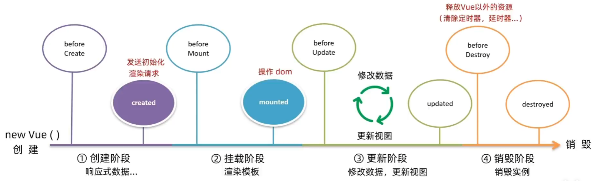

# Vue2

Vue是一个用于构建用户界面的渐进式＋框架

通过创建vue实例来对容器进行渲染

## 入门

- 导入js文件：`<script src="https://cdn.jsdelivr.net/npm/vue@2.7.14/dist/vue.js"></script>`

- 创建vue实例

  ```js
  const app = new vue(){
  	el: '', //通过el配置选择器
  	data: { //通过data提供数据
  		title: ''
  	}，
  	methods: { //提供处理逻辑函数
  		fh(){} //在方法中使用this.变量名调用数据
  	}
  }
  ```

- 插值表达式

  - 在容器中利用表达式进行插值渲染
  - 语法：`{{ 表达式 }}`
  - 不具备解析标签的功能，只能粘贴纯文本
  - 可以使用表达式（`age >= 18 ? "成年" : "未成年"`，`name.toUpperCase`）不能使用语句（`if`）

- 响应式数据
  - data中的数据最终会被添加到实例上
  - 访问数据和修改数据都可以使用`实例.属性名`
  - **数据改变，视图会自动更新**
    - 底层逻辑：监听数据修改，数据改变则利用dom操作更新视图

## 生命周期



## vue指令

- `v-html = 'msg'`：动态获取当前元素的innerHtml（可以解析）
- `v-show`、`v-if`，通过表达式控制元素的展示和隐藏
  - v-show底层原理是通过`display:none`，适用于频繁切换显示隐藏的场景
  - v-if底层原理是基于条件判断是否创建和移除元素节点，适用于不频繁切换
- `v-else`、`v-else-if`辅助v-if进行条件判断
- `v-on:事件名 = "内联语句/函数名"`：绑定时间函数，其中 v-on 可以用 @ 代替

- `v-bind:属性名 = "表达式"`：动态设置html的标签属性（src、url），v-bind:可以直接用' :属性名 '代替
  - v-bind操作class：`:class = "{ 类名1: 布尔值, 类名2: 布尔值}"`或者`:class = "[ 类名1, 类名2 ]"`

  - v-bind操作style：`:style = "{ width : percent + %}"`

- `v-for="(items,index) in 数组"`，基于数据循环，多次渲染整个元素，items是数组中的每一个元素，index索引可以省略
  - `:key = "唯一值"`：给元素添加的唯一标识，不添加的话，vue默认行为会原地修改元素，给第一个元素添加的样式删除后会继承给下一个
  - key只能是字符串或者数字类型
- `v-model`给表单元素使用，给表单内元素添加双向数据绑定（数据变化 < = = > 视图变化），快速获取或设置表单元素

### 按键修饰符

- `@keyup.enter`监听键盘回车事件，不加enter就是键盘按下事件
- `v-model.trim = "username"`：自动消去首尾空格
- `v-model.number = "age"`：自动转换成数字类型
- `@事件.stop`阻止冒泡、`@事件.prevent`阻止默认行为

## computed计算属性

基于现有数据，计算出来的新属性，==依赖于数据变化==

```js
data: {},
computed: {
	计算属性名(){ //这种写法只能获取不能修改计算属性值
	return 基于现有数据，编写求值逻辑并返回
}}
```

- 计算属性内使用this关键字指向vue实例（`this.数据`）
- 使用起来和普通数据一样
- 提前缓存，性能很高

完整写法：

```js
computed:{
	计算属性名(){
		get(){return 结果},//读取计算属性时调用
		set(value){}		//修改计算属性时调用，修改的值传入参数
	}
}
```

## watch监视器

监视数据变化，当数据变化时调用执行，通常搭配防抖执行

```js
data: {},
watch: {
	数据属性名(newValue,oldValue){},
	'对象.属性名'(newValue,oldValue){}
}//oldValue可以省略
```

完整写法

```js
watch: {
	对象obj: {
		deep: true,//深度监视，对象中每一个属性变化都会调用函数
		immediate: true,//初始化立刻调用一次
		handler(newValue){}
	}
	
}
```

## 工程化

Vue CLI是vue官方提供的一个全局命令工具，可以帮助我们快速创建一个开发Vue项目的脚手架（继承了webpack）

- 全局安装：`npm i @vue/cli -g`
- 查看Vue版本`vue --version`
- 创建项目：`vue create project-name`
- 启动项目：进入项目目录下`npm run serve`，在package.json里面可以更改启动命令

```js
import Vue from 'vue'
import App from './App.vue'

Vue.config.productionTip = false// 生产环境/开发环境

new Vue({//vue 实例化
  render: h => h(App),//基于App.vue创建结构渲染
}).$mount('#app')//挂载进index.html中的app容器
```

## 组件化开发

将页面拆分成一个个组件，每个组件都有自己独立的结构（template）、样式（style）和行为（script）

最上层的是根组件，用于包裹各个小组件

### 注册组件

- 局部注册：只能在注册的组件内使用

  - 创建Vue文件

  - 在根组件中导入：

    ```js
    <script>
    import HelloWorld from './components/HelloWorld.vue'
    //import 组件名 from 路径
    export default {
      components: {
        HelloWorld //注册组件：组件名:组件对象，组件名和组件对象名同名即可省略
      }
    }
    </script>
    ```

  - 使用：在结构中直接使用组件名标签即可
  - 命名规范：大驼峰命名法

- 全局注册：在所有的组件范围内都可以使用

  - 创建Vue文件

  - 在main.js中导入：
    ```js
    import Hello from './components/HelloWorld.vue'
    Vue.component('HelloWorld', Hello)  //Vue.componet(组件名，组件对象)
    ```

  - 在组件中直接使用组件名标签即可

### 组件的组成

- template
  - 有且只能有一个根组件（div）
- style
  - 默认全局样式：影响所有组件，无论父子组件都会影响
  - 局部样式（scoped）：只作用于当前组件
    - 写法：`<script scoped> div{} <script>`
    - 原理：
      - 给当前组件模板下的所有元素添加一个自定义属性（`data-v-hash值`），用于区分不同组件
      - css选择器后面被自动处理，加上了属性选择器`div[data-v-hash值]`

- script

  - data必须是一个函数

  - 原理：为了保证每个组件的数据独立，如果展示三个相同的组件，data函数就会执行三次，得到三个数据对象

  - 写法:
    ```js
    export default{
    	data () {
           return {
             count : 100
           }
       }
    }
    ```

### 组件通信

- 父传子：

  - 父组件在注册子组件时，以添加属性的方式传值
  - 写法：`<Son :属性名='数据'></Son>	`
  - 子组件通过props接收
  - 写法：`props: ['属性名']`
  - 子组件可以通过属性名直接渲染使用

- 子传父：

  - 子组件需要在方法内使用`this.$emit('通知方法名',数据)`通知父组件
  - 父组件需要对消息进行监听`<Son :属性名='数据' @通知方法名="处理方法名"></Son>	`
  - 父组件再调用处理方法修改传入的数据

- props校验：为组件的prop指定验证要求，不符合要求会有错误提示

  - 类型校验

    - 写法：`props:{ 属性名: 数据类型 }`

  - 完整写法：
    ```js
    props: {
        校验的属性名: {
          type: 类型,
          require: true,//是否必填
          default: '',//默认值
          validator(value){
            //自定校验逻辑
            return true//是否通过校验
          }
        }
      }
    ```

  - 通过prop传递的数据遵循单向数据流，子组件不能随意更改，只能通过通知父组件更改

- 非父子通信

  - 事件总线（event bus）

    - 创建一个都能访问到的事件总线（空的Vue实例）→utils/EvenBus.js

    - 接收方，监听Bus实例的事件
      ```
      created(){
      	Bus.$on('监听事件名',(msg) =>{代码处理逻辑})
      }
      ```

    - 发送方，触发Bus实例的事件`Bus.$emit('监听事件名',数据)`

  - 跨层级通信（provide&inject）

    - 父组件provide提供数据
      ```js
      export default {
        provide:{
          color: 'red',//普通类型是非响应式的，不推荐
          obj: {		  //复杂类型是响应式的，推荐使用
            sex: 'male'
          }
        },//ps：非响应式传的数据是死的，父组件的数据改变，子组件拿到的数据还是原来传的那个
      ```

    - 子组件inject取值使用：`inject: ['color']`

#### v-model详解

- 双向数据绑定原理：
  - 数据变，视图跟着变：`:value`
  - 视图变，数据跟着变：`@input`
  - 例子：input输入框`v-model="msg"`==`:value  @input="msg = $event.target.value"`
  - @event用于模板中，获取事件的形参
- 表单类组件封装：
  - 父组件动态传递props参数，拆解v-model绑定数据
  - 子组件数据改变时通知父组件，父组件监听消息进行更改
  - 本质上实现父子组件的双向数据绑定
  - 简化写法：
    - 父组件直接v-mode绑定数据，
    - 子组件props通过value接收并通知处理函数input

#### 	sync修饰符

- 可以实现父子组件的双向数据绑定
- 语法 ：父组件`:属性名.sync`，子组件直接`props['属性名']`接收，通知函数`this.$emit('update:属性值',数据)`
- 原理：`:属性名.sync=数据` 本质上是`:属性名 @update:属性名="数据=$event"` 

#### ref、$refs、\$nextTick

- 获取Dom元素
  - 目标标签添加`ref="属性值"`属性
  - 通过`this.$refs.属性值`获取该元素
  - 通过querySelector查找范围是整个页面
- 获取组件实例
  - 目标组件添加ref属性
  - 父组件通过`this.$refs.属性值.组件方法`可以调用子组件的方法，如表单提交

- 异步更新
  - Vue采用的异步更新DOM的手段
  - 当数据引起视图更新的时候，Dom元素还未加载完成，获取的Dom元素将为undefined
  - 解决方法：
    - 在Dom更新之后再做的事可以使用$nextTick
    - `this.$nextTick(() => { 业务逻辑 })`

## 自定义指令

- 全局注册

  - 在main.js中定义

  - ```
    Vue.directive('指令名', {
    	"钩子函数"(el){
    		el.focus()//对el标签扩展额外功能
    	}
    })
    ```

- 局部注册
  ```
  directive:{
  	focus : { //指令名
  		inserted(el,binding){	//钩子函数，可以写多个，inserted是插入时的操作
  			el.focus()//函数逻辑
  			el.style.color = binding.value//通过binding.value可以拿到指令的值
  		}
  		update(el){ 指令的值更新的逻辑操作 }
  	}
  }
  ```

## 插槽

- 插槽就是自定义组件，组件的某一部分结构不确定

- 简单使用（默认插槽）：
  - 在自定义组件内使用`<slot></slot>`占位
  - 在引用组件时填入内容
  - slot标签内填入默认内容，引用组件时没有填入内容则会显示默认内容
  
- 具名插槽：
  - 即有多个需要填入的内容
  - slot占位，使用name属性起名字来区分（`name='名字'`）
  - 引用组件时使用template配合`v-slot='名字'`分发内容，插槽一旦起了名字就必须通过这个方法定向分发
  - `v-slot='名字'`可以简写为`#名字`
  
- 插槽传参（作用域插槽）

  - 父传子以添加属性的方式进行传参

  - 子传父：

    - 给`slot`标签以添加属性的方式传参
    - 所有属性都被收集到一个对象之中
    - 引用组件时用在template中，用`#插槽名="obj"`接收，默认插槽名为default

    ```
    <MyTable :list="list">
    	<template #default="obj">
    	<button @click="del(obj.id)">删除</button>
    	</template>
    </MyTable>
    ```


## 路由

- 基本使用
  ```
  //下载：npm i vue-router@3.6.5
  import VueRouter from 'vue-router';//引入
  Vue.use(VueRouter)//安装注册
  const router = new VueRouter()//创建路由对象
  new Vue({
    render: h => h(App),
    router //注入到Vue实例，
  }).$mount('#app')
  ```

- 创建路由规则
  ```
  const router = new VueRouter({
    routes: [
      { path: '/find', component: App}//路径与组件匹配关系
    ],
    //自定义高亮类名
    linkActiveclass: 'active',
    linkExactActiveClass: 'exact active'
  })
  ```

- `href="#/find"`配置导航， `route-view`控制组件展示的位置

- 模块封装

  - 创建包router，在包里创建js文件来配置Vue
  - 注意注册VueRouter时需要导入Vue模块
  - 用`export default router`到处路由对象，并在main.js中中接收注册

### 路由跳转

- router-link

  - Vue-Router提供的全局样式，本质上是对a标签的封装
  - `to="/find"`：to属性代替href实现路由跳转，并且不用写#号
  - 被选中的router-link渲染时会在a标签中加入两个高亮类名
    - `router-link-active`模糊匹配，适用于多级路由
    - `router-link-exact-active`精准匹配
    - 利用这两个类名的样式进行高亮渲染
    - 创建路由规则时可以自定义高亮类名

- 导航跳转传参

  - 查询参数传参（多个参数）
    - 跳转：`to="/path?参数名=值"`
    - 接收：`$route.query.`参数名，在created方法里使用`this.$route.query.参数名`接收
  - 动态路由传参
    - 配置动态路由`path: "/path/:参数名?"`，不加`?`则必须要传参
    - 传参：`to="/path/参数值"`
    - 接收：`$route.params.参数名`

- 编程跳转传参

  - 简单跳转：`this.$router.push("/路径")`

  - 路由取名可以减少路径的书写，`{ name: 'find', path: '/find', component: App}`

  - query传参

    - `this.$router.push("/路径?参数=值&参数2=值")`

    - ```
      this.$router.push({
              path: '/路径',//可以使用路由名字代替
              query:{
                参数名: '值',
                参数名2: '值',
              }
            })
      ```

  - 动态路由传参

    - `this.$router.push("/路径/参数值")`

    - ```
      this.$router.push({
              path: '/路径',//可以使用路由名字代替
              params: {
                参数名: '值', 
              }
            })
      ```

- 路由重定向

  - 匹配到该路径后强制跳转另一路径
  - 写法`{path: "/", redirect: '/index}'`

- 路由模式设置

  - 默认hash路由（路径带#号）

  - 修改为history路由（路径不带#号）
    ```
    const router = new VueRouter({
      routes: [],
      mode: history
    })
    ```

- 嵌套路由（子路由）：在自己定义的路由里用chilren声明子路由数组即可，**子路由路径不用加/**

### 全局前置导航卫士

- 所有的路由在真正被访问到之前都需要经过全局前置导航卫士
- 只有导航卫士放行才能渲染出页面

```
const authUrls = [] //存放直接放行的页面
router.beforeEach((to, from, next) => {
  if(!authUrls.includes(to.path)){//判断是否为非权限页面，然后直接放行
    next()
    return
  }
  //此处编写非权限页面的验证逻辑
})
//to 到哪里去的路由信息对象（路径，参数）
//from 从哪里来的路由信息对象（路径，参数）
//next 是否放行
//next() 直接放行，next(路径)拦截跳转
```

## vuex

vuex是一个状态管理工具（插件），状态就是数据，可以帮我们管理通用数据（多组件共享的数据）

- 创建仓库

  - 安装：`npm install vuex@3`
  - 新建store/index.js
  - 导入安装注册`import Vuex from "vuex"`
  - 创建仓库`const store = new Vuex.Store()`
  - 导出仓库并在main.js中挂载

### state

- 存放数据

  ```js
  const store = new Vuex.Store({
      state:{
          count: 101
      }
  })
  ```

- 使用数据

  - 通过store直接访问：`this.$store.state.xxx`

  - 通过辅助函数mapState（简化）：

    - 在组件中导入` import { mapState } from 'vuex'`

    - 使用mapState自动生成计算属性
      ```
      computed: {
          ...mapState(['存放的数据名','xxx'])
        }
      ```

### mutations

- 在vuex中同样遵循单向数据流，组件中不能直接修改仓库中的数据（这是一种规范，实际操作是可以修改的），在创建仓库时开启严格模式即可避免这种不规范操作

- state数据只能通过mutations修改

- 使用：

  - 定义mutations对象，对象中存放修改数据的方法

  ```js
  const store = new Vuex.Store({
      state:{
          count: 101
      },
      mutations:{
          addCount(state, n){//第一个参数是state
              state.count += n
          }
      }
  })
  ```

  - 组件提交时调用mutations：`this.$store.commit('addCount',n)`
  - ==提交参数有且只能有一个==，如果有多个参数需要传递，则通过包装成对象来传参

- 辅助函数mapMutations：

  - 和mapState类似，能在组件中将mutations中的方法映射到组件methods中

  - 使用：

    - 导包`import { mapState, mapMutations} from 'vuex'`

    - ```
      methods: {
          ...mapMutations(['xxx'])
        }
      ```

    - 在组件中就可以直接调用方法


### actions

- actions是用于处理异步操作的，mutations必须同步操作来保证数据同步

- 用法：
  ```js
  actions:{
          setAsyncCount(context,num){//context表示上下文，可以当成仓库
              //这里可用于异步发送请求
              context.commit('addCount', num)//还是需要mutations来修改数据
          }
      }
  ```

- 组件中调用：`this.$store.dispatch('xxx', num)`

- 辅助函数：与mapMutations一样，将actions中的方法映射到组件方法中

### getters

- 与计算属性类似

- 用法：
  ````js
  getters:{ //定义一个必须有返回值的函数
          filterList(state){//第一个参数必须是state
              return state.list.filter(item => item > 5)
          }
      }
  ````

- 访问：`this.$store.getters.xxx`
- 辅助函数：`mapGetters`，定义在组件的计算属性里（computed）

### 分模块

- 模块拆分

  - 创建model文件夹，在此文件夹下可以写多个js文件形成多个模块

  - 每个模块都定义自己的仓库等，并将其导出
    ```
    const state = {}
    const mutations = {}
    export default {
        state,
        mutations
    }
    ```

  - 在根模块进行导入`import user from "./model/user"`并使用

    ```
    modules:{
            user
        }
    ```

- 模块访问

  - 直接访问：

    - `$store.state.模块名.xxx`
    - `$store.getters['模块名/xx']`
    - `$store.commit('模块名/xxx',额外参数)`
    - `$store.dispatch('模块名/xxx',额外参数)`

  - 默认根级别映射

    - `...mapState(['模块名'])`会直接返回整个模块对象
    - `模块名.xxx`即可访问数据

  - 子模块的映射

    - 子模块导出时需要开启命名空间
      ```
      export default {
          namespaced: true,
          state,
          mutations
      }
      ```

    - 在组件就能直接映射子模块：`...mapState('模块名',['xxx'])`

### 持久化存储


## Vue-Cli自定义创建

1. `vue create project-name`
2. `Manually select features`//手动选择特性
3. Babel、Router、CSS Pre-processors、（Linter/Formatter）//选择需要添加的特性
4. 选择vue版本
5. 选择路由模式：history或hash
6. Sass/SCSS、Less、Stylus//选择预处理器，Less
7. 选择ES规范：`ESLint+standard config`，无分号规范，标准化
8. 选择在什么时候进行校验：`Lint on save`保存时校验
9. 将配置文件写在哪里：`In dedicated config files`在专用配置文件中

## ESlint代码规范

- 选择Linter特性，代码不规范都会在终端进行提示

- 手动修改错误：JavaScript Standard Style规范说明https://standardjs.com/rules-zhcn.html

- 自动修改：

  - 基于vscode插件中的ESLint扩展高亮错误

  - 通过配置自动帮助我们修改错误：设置的右上角打开设置，输入配置
    ```
    "editor.codeActionsonSave" : {//当保存的时候,eslint自动帮我们修复错误
    	"source.fixAll": true
    },
    "editor.formatOnSave" : false//保存代码,不自动格式化
    ```

    

## 组件缓存

- 组件切换时需要重新加载，并且可能会失去之前的进度，这是因为组件跳转后会自动销毁
- 使用keep-live可以缓存不活动的组件实例（保存在内存中），而不是销毁他们
- keep-live是Vue的内置组件，直接用keep-live标签包裹需要缓存的组件即可
- keep-live有三个属性：include、exclude、max，前两个是组件名数组，分别表示匹配的组件和除了哪些组件不匹配
- keep-live包裹的组件使用的时候会触发两个周期函数：`activated`：组件激活时调用，deactivated：组件不被使用的时候触发

# Vue3

## 入门

- 创建项目：`npm init vue@latest`，这种方式是基于vite的项目创建方式
- 插件：
  - vue2：Vetur
  - vue3：Volar

- 项目目录和文件与vue2的区别
  - vite.config.js——基于vite的配置
  - main.js——createApp函数创建应用实例
  - app.vue
    - script脚本写在最上面
    - template不再要求添加唯一根元素
    - script脚本添加setup标识支持组合api
- setup选项
  - setup实际上是一个钩子函数，生命周期在beforeCreated之前
  - 在Vue3中通常都是将函数的数据都定义在setup中，然后以对象的方式return出去就能被组件使用
  - 使用在script后加上setup标识，就能开启语法糖的写法，每个定义数据和函数都会被自动return，不用自己手写


## 组合式API

- reactive和ref

  - 传统定义的数据setup出去之后并不是响应式数据，无法改变，需要通过reactive或ref转换成响应式数据

  - reactive：接收一个对象类型的数据，返回一个响应式的对象

  - ```
    import { reactive } from 'vue';
    const state = reactive({
      count: 100
    })
    ```

  - ref：接收一个简单类型或者对象类型的数据，返回一个响应式的对象，底层原理就是包装成对象，再通过reactive返回

  - ```
    import { ref } from 'vue';
    const count = ref(100)
    const add = () =>{
      count.value++
    }
    ```

  - 一般统一使用ref，但是ref返回的响应式对象在脚本中需要通过`.value`的形式获取或修改数据，在template中直接使用
  
- 计算属性computed

  - ```
    const 计算属性 = computed(() => {
    	return 计算返回的结果
    })
    ```

- watch监视器

  - 监视单个数据：`watch(ref对象, (newValue, oldValue) =>{ ...})`

  - 监视多个数据：`watch([ref对象1, ref对象2], ( newArr,oldArr) =>{ ...} )`

  - 完整写法：
    ```js
    watch(ref对象, (newValue, oldValue) =>{ 
    	... 
    },{
    	deep: true,//深度监视，对象中每一个属性变化都会调用函数
    	immediate: true,//初始化立刻调用一次
    })
    ```

  - 精确监听
    ```
    watch(
    	() => 监听对象的属性,
    	(newValue,oldValue) => {函数逻辑}
    )
    ```

- 生命周期函数

  - 在Vue2钩子函数前加`on`
  - 例子：`onMounted(() => { //挂载时执行的函数 })`
  - 可以有多个生命周期函数，setup会按顺序执行
  - created和beforeCreated用setup代替


## 组件通信

- 组件引用：

  - 局部组件：脚本导入后直接当标签使用

- 组件通信：

  - 父传子：

    - 父组件以添加属性的方式传值：`<Son car='宝马' :money='数据名'></Son>`

    - 子组件需要借助“编译器宏”函数接收（加了setup标识，无法直接配置props）
      ```
      const props = defineProps({
      	car: String,
      	money: Number
      })
      ```

    - 在脚本中接收到的props需要`props.car`，在template中直接`car`使用

  - 子传父

    - 父组件：`@监听事件名="处理函数名"`

    - 子组件：通过emit触发事件
      ```
      const emit= defineEmits(['监听事件名'])  //借助编译器宏
      const clickThis = () => {
          emit('监听事件名',2)
      }
      ```

# 杂记

- `Dom对象.focus()`获得焦点，通常用于页面挂载完成后直接让表单输入框获得焦点
- 路径中`@`代表src
- `<script setup>中的代码会在每次组件实例被创建之前执行`

# Axios实例

    //常用的基本配置
    const instance = axios.create({
        baseURL:'http://localhost:8080', //请求的域名，基本地址
        timeout:5000,  //请求的超时时长，单位毫秒
        url:'/data.json',  //请求的路径
        method:'get，post，put，patch，delete' , //请求方法
        headers:{
            token:''  //比如token登录鉴权，请求的时候携带token，让后端识别登录人的信息
        },   //请求头
    })
    //添加请求拦截器
    instance.interceptors.request.use(function (config){
    	return config//发出请求时该做什么
    }, function(){
    	return Promise.reject(error)
    })
    //添加响应拦截器
    instance.interceptors.response.use()
