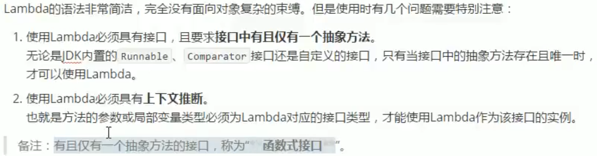
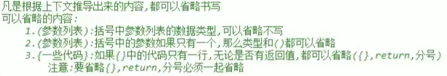

# 杂记

- "&&","||",具有短路效果,即根据左边已经可以判断结果则不会执行右边的代码(节省性能)

- 在本类的构造方法中可以用`**this**`访问另一个构造方法(通常用于无参调有参来赋值初始值以节省代码)

- ==包装类==中的静态方法:toString(...),int parseInt(String)(字符串->基本类型)

- 静态方法不建议创建对象使用,而是直接通过类名称使用

- 泛型通配符只能接受数据,不能往集合存储数据

- 多用包装类，int a = null 会报空指针异常

- shift+F6定义所有名称一起变

- 鼠标中键查看源码


# 命名规则

\* 全小写：包名、项目名
 \* 全大写：不可改变的常量
 \* 小驼峰：变量名、方法名
 \* 大驼峰：类名

# 数据类型

注意事项:

1. long类型后缀加"L",float后缀加"F"
2. byte/short/char 在运算的时候会被提升为int(byte+short-->int+int-->int)
3. boolean不能发生数据类型转换
4. boolean值在类的getter方法一定要写isXxx的形式
5. 符合运算符自动发生自动类型转换
6. 强制类型转换：int a = (int)3.14;

# Java内存划分


# 权限修饰符规则


# 匿名对象

只能使用一次(==调用方法)==,格式为`int i = new Scanner(System.in).nextInt()`,可以作为参数和返回值:`method(new Scanner(System.in))`,`return new Scanner(System.in)`

# 可变参数

方法的参数类型确定,参数个数不确定就可以用可变参数

格式:(定义方法时使用)修饰符 返回值类型 方法名(数据类型 . . . 变量名)变量名是一个数组

原理:建立一个数组(长度刚好)存储所有参数

注意:

1. 不能在一个方法里头创建多个可变参数
2. 可变参数必须放在参数列表的末尾

终极用法:Object类型

# 一些基本类

## Random

创建:Random r = new Random()

使用: 

1. int num = r.nextInt()范围是int所有,有正负

2. int num = r.nextInt(int num)

   参数范围[0,num)左闭右开

## Object

介绍:所有类的父类

1. toString()方法:打印的是包名类名的地址值,重写后直接打印对象中的属性值
2. equals()方法:比较两个对象的地址值,重写后比较对象中的属性值

Objects类

1. equals()方法:Objects.equals(Object A,Object B)可以避免空指针异常
2. requireNonNull(obj,~~String message~~)抛出空指针异常

## System

内含大量静态方法获取与系统相关的信息或系统级操作

1. long currentTimeMillis()返回以毫秒为单位的当前时间
2. void arraycopy(Object 数组1,int 起点,Object 数组2,int 另起点,int 长度)将数组1复制到数组2

## Date DateFormat

Date:构造方法:

1. 无参构造:打印后直接显示当前系统的时间
2. 有参构造:传递毫秒值(long类型),把毫秒值转换为Date日期

成员方法:

- ==long== getTime()把日期转换为毫秒(相当于System.currentTimeMillis())

- String toLocaleString()根据本地格式转换日期对象

Dateformat:

本身是一个抽象类,父类是Format,子类是SimpleDateformat(**主要**)

作用:格式化(日期->文本或文本->日期)

抽象方法:format和parse

**SimpleDateformat**:

==构造方法==:SimpleDateformat(String pattern)用给定的模式和默认语言环境的日期格式符号构造

参数:String pattern:传递指定模式

| 年   | 月   | 日   | 时   | 分   | 秒   |
| ---- | ---- | ---- | ---- | ---- | ---- |
| y    | M    | d    | H    | m    | s    |

写对应模式会把模式替换成对应的日期和时间,如"yyyy-MM-dd HH:mm:ss"(符号可改)

成员方法:

1. String format(Date date)将Date对象按照指定模式把日期和时间格式化为字符串
2. Date parse(String source)将符合模式的字符串解析为Date日期,使用这个方法的时候会抛出异常,通常采用快捷键alt+回车处理(通常第一个),main方法也得处理异常

## Calendar

 Calendar本身是一个抽象类,但是它有一个静态方法能构造它的子类

即:`static Calendar getInstanc()`

成员方法://field可以通过静态的成员变量获取`static final int Year=1`

1. int get(int field):返回给定日历字段的值
2. void set(int field,int value):将给定的日历字段设置为给定值(**有多种重载**)
3. ~~abstract~~ void add(int field,int amount):根据日历的规则,为给定的日历字段添加或减去指定的时间量
4. Date getTime():返回一个表示此Calendar时间值()

```java
Calendar c = Calendar.getInstance();//多态
int month = c.get(Calendar.MONTH)+1//西方的月0-11,东方1-12,所以通常加1
c.set(8888,8,8)//set(int year,int month,int data)这是一种重载
```

## Arrays(数组工具)

1. String toString(数组)将参数数组变成字符串
2. String deepToString(二维数组)将二维数组变成字符串
3. void sort(数组)按照升序进行排序(字符串按照字母升序)
4. Arrays.copyOf(数组,新长度)把指定数组赋值成一个指定长度的新数组
5. System类中有数组拷贝方法

## Maths(数学类工具)

1. double abs(double num)取绝对值.(**有多种重载**)
2. double ceil(double num)向上取整.
3. double floor(double num)向下取整.
4. double sqrt(double num)平方根
5. long round(double num)四舍五入.
6. Math.PI代表圆周率

## Collection（集合类工具）

1.  static void shuffle(List<?> list)  使用默认随机源对指定列表进行置换(打乱集合中的元素)

2.  static <T> boolean void addAll(Collection<T> c,elements: . . .)往集合中添加一些元素

3.  static <T> void sort(List<T> list)将集合中的元素按照默认规则排序

   注意:被排序的集合里的元素必须实现Comparable接口,重写接口中的compareto方法

   compareto的排序规则:return 自己(this.age) - 参数.age:升序   反之亦然

4.  static <T> void sort(List<T> list,comparator<? super T>)指定规则排序

   通常对接口Comparator建立匿名内部类重写compare方法(o1-o2为sheng'xu)

5.  list,map,set都有of方法可以一次性添加很多元素，返回值是一个集合且不能增删改

## ArrayList

**注意:直接打印的不是地址值而是内容**

### 定义

ArrayList<引用类型> 名称=new ArrayList<>();

==本身是一个数组结构,源码是创建新数组再将原数组放进去,所以查询快,增删慢==

**集合只能存储包装类(引用类型),如果要存储基本类型数据,必须使用基本类型对应的"包装类"**


### 常用方法

1. add()添加元素,返回值为boolean(没什么用)
2. get(int index)从集合中获取元素,参数为索引编号
3. remove(int index)从集合删除元素,返回值就是被删除的元素
4. size()返回集合中元素的个数(int值)

# String

## 1.注意事项

1. **对于引用类型来说,==进行的是地址值的比较**
2. **双引号直接写的字符串在常量池,new的不在池中**
3. **字符串的底层是一个被final修饰的数组,不能改变,是一个常量**

## 2.常用方法

1. 比较方法

   1. equals(object obj)参数可以是任何对象

   如果比较双方一个常量一个变量,推荐把常量写在前面(变量在前容易空指针异常)

   	2. equalsIgnoreCase(String str)忽略大小写的内容比较

2. 获取方法

   1. Length()字符串长度(int)
   2. concat(String str)将当前字符串和参数字符串拼接成为返回值(**新的字符串**)
   3. charAt(int index)获取指定索引位置的单个字符(**从0开始**)

3. 查找方法

   int indexOf(String str)查找参数字符串在本字符串当中首次出现的索引位置,没有则返回-1

   int indexOf(String str，int fromIndex)从指定位置向后寻找指定字符串位置没有则返回-1

   boolean endsWith(String suffix)判断是否以参数字符串结尾

   boolean startsWith(String prefix)判断是否以参数字符串开头

   ==还有更多查找方法去csdn==

4. 截取方法

   1. substring(int index)截取从参数位置一直到字符串末尾,返回新字符串

   2. substring(int begin,int end)截取从begin开始一直到end结束

      **[begin,end)左闭右开**

5. 转换方法

   1. char[] toCharArray()将当前字符串拆分成字符数组作为返回值

   2. byte[] getBytes()获得当前字符串底层的字节数组

   3. String replace(CharSequence oldString,CharSequence newString)

      将所有出现的老字符串替换成新的字符串

   4. String toLowerCase()转换为全小写

   5. String toUpperCase()转换为全大写

   6. String trim()删除左右空格  

   7. String replaceAll()删除所有空格

6. 分割字符串

   String split(String regex)按照参数规则分割字符串由字符串数组保存

   注意:split方法的参数其实是一个"正则表达式"

   如果按照英文句点"."进行切分,必须写"`\\.`"

## 3.StringBuilder类

字符串缓冲区,底层也是一个数组但是没有被final修饰,当容量不够时会自动扩容

作用:将String和StringBuilder相互转换提高效率

构造方法:无参和有参都有,有参就是将参数String 字符串添加进去

成员方法:

1.  StringBuilder append(...)添加任意类型数据的字符串形式,并返回自身

   链式写法:`bu1.append("abc").append(1).append(ture).append('中')`

2. StringBuilder reverse()反转内容

3. String toString()将StringBuilder对象转换为String对象

# 静态static

1. 只在类中保存唯一一份,所有本类对象共享同一份,一旦用了static,那么这样的内容不再属于对象自己而是属于类的
2. `private static int idcounter=0`计数器,每创建一个新对象得到一个编号
3. 静态方法不需要创建对象,直接通过类名称来使用它
4. 无论是成员变量还是成员方法都推荐,如果有static,都推荐使用类名称进行调用
5. 静态不能直接访问非静态,静态方法中不能使用`this`

**静态代码块**：

格式:

```java
public class 类名称{
 	static{
 	//静态代码块内容
 	}
}
```

特点:**当第一次用到本类时,静态代码块执行唯一一次**(**通常用于一次性对静态成员变量进行赋值**)

# final关键字

1. 修饰类:不能被继承,即没有子类
2. 修饰方法:不能被覆盖重写
3. 修饰局部变量:==只能被赋值一次==,对于==引用类型,==不可改变的是==地址值==,可以调用函数改变内容
4. 成员变量:必须手动赋值,不会有默认值,要么直接赋值,要么构造函数赋值且所有重载的构造函数都要对final的成员变量赋值.直接和构造函数二者选其一.

# 继承(共性抽取)

**设计原则:对于已经投入使用的类,尽量不要进行修改,推荐定义一个新的类,来重复利用其中共性内容,并且添加改动新内容**

**Java语言的继承特点:1.单继承2.多级继承(java.lang.Object是祖宗级)3.父类唯一**

**定义:`public class 子类 extends 父类{  }`**

## 重名

变量重名：

1. 局部变量:直接写
2. 本类成员变量:this.
3. 父类成员变量:super.

方法重名:创建的对象是谁就优先用谁

## 方法的重写(覆盖)

1. 父子类之间方法的名称相同,参数列表也相同

   `@override`写在方法前面可以用来检测是否有效

2. 子类方法的返回值必须**小于等于**父类方法的返回值范围(比如object与String)

3. 子类方法的权限必须**大于等于**父类方法的权限修饰符

   public>protected>(defaul)(什么都不写)>private

```java
public void show(){
	super.show;(直接调用父类,再往下加内容)
	……
}
```

## 构造方法的特点

1. 子类的构造方法运行时,必然先运行父类的构造方法(如果没写则默认隐含一个`super()`)
2. 子类的构造方法可以通过super关键字来调用父类的重载构造方法
3. super的父类构造调用必须是子类构造的第一个且只有一个

# 抽象类与方法

定义:抽象方法所在类必须是抽象类

```java
public abstract class Animal{//class前加abstract
	public abstract void eat();//返回值之前加上abstract,去掉大括号直接分号结束
}
```

注意:

1. 不能直接new抽象类
2. 必须用子类继承抽象父类
3. 子类必须覆盖重写父类当中的所有抽象方法(去掉abstract,补上方法体大括号)

# 接口

==接口可以作为成员变量类型还可以作为方法的参数和返回值==

## 接口的概述

接口就是多个类的公共规范,是一种**引用类型**,最重要的是其中的**抽象方法**

定义:`public interface 接口名称{ // 接口内容 }`

注意:

1. 接口当中的抽象方法,修饰符必须是两个固定的关键字:public abstract
2. 这两个关键字修饰符,可以选择性地省略
3. 方法的三要素可以随意定义

接口的使用步骤:

接口不能直接使用,必须有一个"实现类"来"实现"接口

格式:

```
public class 实现类名称 implements 接口名称{ // 抽象方法的覆盖重写}
```

创建实现类的对象进行使用

**实现类可以是抽象类**

## 接口中的常量:

接口当中的成员变量相当于,必须使用public static final三个关键字进行修饰.

格式:

`public static final 数据类型 常量名称(大写字母加下划线分隔) = 数据值`

注意:

1. 修饰词可以省略(三个都可以)
2. 必须进行赋值且无法改变
3. 大写字母加下划线的命名规则

使用:接口名称.常量名称

## 接口的几个方法

1. 默认方法

   格式:

   ```
   public default 返回值类型 方法名称(参数列表){ 方法体 }
   ```

   用途:用于解决接口升级的问题,实现类过多难以修改

   注意:

   1. 接口的默认方法可以通过实现类对象直接调用

   2. 接口的默认方法可以被实现类进行覆盖重写

2. 静态方法

   格式:将static或default改为static即可

   注意事项:**不用通过实现类的对象来调用接口中的静态方法(因为存在多个接口),只能通过接口名称直接调用其中的静态方法(接口名称.静态方法名(参数列表))**

3. 私有方法

   1. 普通私有方法:`private 返回值类型 方法名称(参数列表){方法体}`

      解决多个默认方法的之间的重复代码问题

   2. 静态私有方法:` private static 返回值类型 方法名称(参数列表){方法体}`解决多个静态方法之间的重复代码问题

    用途:解决接口当中代码重复问题,但是不让实现类调用(冲突)

   私有方法只有接口当中的其他非私有方法可以调用

## 注意事项(多继承)

1. 接口中是没有静态代码块和构造方法的

2. 一个类的直接父类是唯一的,但是一个类可以同时实现多个接口

   格式:`public class 实现类名称 extends 父类名称 implements 接口一,接口二{ // 覆盖重写所有抽象方法}`

3. 如果实现类所实现的多个接口当中,存在重复的抽象方法,那么只需要覆盖重写一次

4. 如果实现类没有覆盖重写所有接口当中的所有抽象方法,那么实现类就必须是一个抽象类

5. 如果实现类所实现的多个接口当中,存在重复的默认方法,那么实现类一定要对冲突的默认方法进行覆盖重写

6. 一个类如果直接继承的父类方法与接口当中的默认方法冲突,优先父类当中的方法

7. 接口与接口之间可以实现多继承,但是多个父接口当中的默认方法重复,那么子接口必须进行默认方法的覆盖重写(而且必须带着defaulter关键字)

# 多态

**父类引用指向子类对象**

格式:父类名称 对象名 = new 子类名称()

或者 接口名称 对象名 = new 实现类名称()

成员变量的访问:直接通过对象名称访问成员变量,**看等号的左边是谁**则优先用谁

成员方法的访问:**编译看左,运行看右**(父子都有用子类,不然用父类,父类没有不能用子类)

好处:无论右边new的时候换成哪个子类对象,等号左边调用方法都不会变化.

## 对象的转型

- **向上转型**:就是多态的写法,右侧创建一个子类对象,把它当作父类来看待使用,从小范围转向了大范围,向上转型一定安全

类似于自动类型转换:double num =100;//int -> double

弊端:无法调用子类原本的内容

- **向下转型**:其实是一个还原动作,将父类对象还原成为本来的子类对象,前提是对象本来创建的时候就是该子类

格式:子类名称 对象名 = (子类名称)父类对象

类似于强制类型转换:`int num =(int) 10.0//double->int`

如果对象创建的时候本来不是该子类,现在非要向下转型,就会报错:==ClassCastException==

类似于:`int num = (int) 10.5//精度损失`

- **instanceof关键字**:判断该父类对象本来是不是后面的子类类型

格式:对象 instanceof 子类名称

这将会得到一个boolean值结果,即前面的对象能不能当作后面类型(能否向下转型)

- **注意**:==使用接口作为方法的参数,可以传入实现类对象来运行方法==(自动向上转型)

类似于自动类型转换:

```java
public static void main(String[] args){
   method(10);// int->double
}
public static void method(double num){方法体}
```

# 内部类

## 1. 成员内部类

内用外随意使用,外用内需要内部对象

使用:

1. 间接:在外部类的方法当中,创建使用内部类,然后main只是调用外部类方法
2. 直接:公式法:`外部类名称.内部类名称 对象名 = new 外部类名称().new 内部类名称()`

外部类成员变量与内部类成员变量冲突时,格式为:`外部类名称.this.外部类成员变量`

## 2.局部内部类

定义:定义在一个方法内部的类

**只有当前所属的方法才能使用它**

格式:`class 局部内部类名称{}`==不能写修饰符(public等)==

局部内部类如果希望访问方法的局部变量,那么这个局部变量必须是==final==的(只要局部变量不变,那么final关键字可以省略),原因是局部变量随栈消失,但new的类对象在堆中持续存在

## 3.匿名内部类


用于接口的实现类只需要使用唯一的一次

格式:

```
接口名称 对象名 = new 接口名称(){
		//覆盖重写所有抽象方法
}
```

1. 匿名内部类在创建对象时使用唯一一次,多次创建对象就要多次单独定义或定义实现类
2. 匿名对象在调用方法时只能用唯一一次,多次调用方法就要给对象起名字
3. 匿名对象和匿名内部类可以嵌套使用,但不是一回事

# 集合


## Iterator

Iterator迭代器是一个接口,需要使用Iterator接口的实现类

获取方式很特殊:利用Collection接口中的iterator()方法,这个方法的返回值就是迭代器的实现类对象

成员方法:

1. E next()返回迭代的下一个元素
2. boolean hasNext()如果仍有元素可以迭代,则返回true

```
Collection<String> coll = new Arraylist<>();//多态
Iterator<String> it = coll.iterator;//多态,迭代器的泛型跟着集合走
while(it.hasNext()){
	String e = it.next();sout(e);
}
```

原理:指针指向前一个元素,hasNext是判断下一个元素是否存在,next取出下一个元素并将指针向后移动一位

## 泛型

1. 类名<泛型>,成员变量<泛型>,成员方法(泛型)

2. 方法:修饰词 <泛型> 返回值类型 方法名(泛型)

3. 接口:

   1. 接口<泛型>,实现类<数据类型>
   2. 接口<泛型>,实现类<泛型>,方法<泛型>

4. 通配符:方法(含泛型的类<?>)

   上限(子类或本身):<? extends 类>,下限(父类或本身)<? super 类>

## list接口

本身是接口,继承自Collection接口(**需要使用多态**),有序,带索引,可以有重复元素


异常:

**Linkedlist**:

底层是一个链表结构,查询慢,增删快


==这些是Linkedlist的特有方法,使用时注意不能使用多态==

## Set

**HashSet**

无序(无索引),不允许存储重复元素,底层是一个哈希表结构(查询速度非常快),只能用迭代器和增强for循环来遍历

​	哈希值:系统随机给的一个十进制整数(就是对象的地址,只不过是逻辑地址)

Object类有hashCode()方法获得对象的哈希值,String类等重写了这个方法(就不是随机数字了)

底层是一个数组和链表(红黑树),元素的哈希值就是数组的索引值,如果有多个元素的哈希值相同(即数组索引下存放多个数据),则通过链表连接存储(当数据超过八个时转用红黑树存储)

==set集合存储元素不重复的前提是存储的元素必须重写hashCode和equals方法==

**LinkedHashSet**

底层是一个数组+链表(/红黑树)+链表,确保了元素有序

## Map

==多使用包装类==，因为返回值如果为空，后续使用可能会报异常

==Map和HashMap会自动对key进行排序==


- public v put(K key , v value):把指定的键与指定的值添加到Map集合中。返回值：key重复则返回原来的value并换成新的value，不重复则返回null

- public v nemove(0bject key):把指定的键所对应的键值对元素在Map集合中删除，返回被删除元素的值。

- public v get(0bject key)根据指定的键，在Map集合中获取对应的值。

- boolean containsKey(0bject key)判断集合中是否包含指定的键。

- public set<K> keySet():获取Map集合中所有的键，存储到Set集合中。

- public Set<Map.Entry<K,v>> entrySet():获取到Map集合中所有的键值对对象的集合(Set集合)。

Entry是Map的内部接口，entry是内部类，Map的底层就是将key和value封装成entry存储，而Set<Map.Entry<K,v>> entrySet()方法能将Map中的所有entry取出来存储到一个Set集合中，entry.getKey()和entry.getValue()能获取Key和Value值

Hashtable：单线程，不允许存储null

# 异常

**Debug追踪**

异常:Exceptio:编译期异常,可以写代码解决,也可以==抛出异常解决==

​		RuntimeException:运行期异常,可以交给jvm解决,例如空指针异常和索引越界异常

错误:无法解决的问题,必须修改源代码

throws关键字:抛出异常


如果抛出的多个异常对象有父子类关系,那么会直接声明父类异常即可

try{可能出异常的代码} catch(异常变量){异常处理逻辑}finally{无论是否出现异常都会执行}


使用多个catch的时候应该把子类异常放在最前面防止多态

如果finally中含有return语句,那么永远返回finally中的结果


# 多线程

创建一个新线程:创建一个子类继承Thread,重写run()方法,在主程序中创建对象调用start()方法

获取线程名字:

1. Thread类中的方法String getName()返回该线程名称
2. static Thread currentThread()返回当前线程对象的引用,再调用getName(可以链式编程)

设置线程名字:

1. Thread类中的方法void setName(String name)改变线程名字

2. 创建一个带参构造方法,调用父类的带参构造方法Thread(String name)

   `public MyThread(String name){ super(name);  }`

常用方法:static void sleeping(long millis)是当前正在执行的线程以指定毫秒数暂停(有异常抛出)

**创建一个线程2**(**常用**):

- 创建一个Runnable接口的实现类对象,重写run()方法,在主函数创建实现类对象,new一个Thread类对象,构造方法中以该实现类对象为参数并调用start()方法(链式编程 )

- 匿名内部类:

```
new Thread(){重写run方法}.start();
/
Runnable r=new Runnable(){重写run方法};
new Thread(r).start();
/
new Thread(new Runnable(){重写run方法}).start();
/
Thread thread = new Thread(new Runnable(){重写run方法})；
thread.start();
```

==线程安全问题原理建议观看视频==

- 解决办法：
  - synchronized(对象){会出安全问题的代码块}
  - 同步方法public synchronized void 方法名(){会出安全问题的代码块}默认锁对象:实现类对象
  - 静态同步方法默认锁本类class属性
  - Lock锁接口,实现类为ReentrantLock，在==成员位置==创建实现类成员对象（多态）,在可能出现线程安全问题的代码前调用实现类对象的lock()方法,在代码后调用unlock()方法,优化:unlock()放在try.catch的finally中
  - 等待唤醒:创建锁对象,在synchronized里头调用锁对象（obj）的wait()方法(处理异常),在另一个线程的synchronized里头调用锁对象的notify()方法解除第一个线程的锁定

- Object类的wait(long 毫秒值)如果没notify唤醒,过一段时间会自动醒来,notifyAll()一次性唤醒所有

线程池:

1. Executors里面的静态方法创建线程池																						`static ExecutorService newFixedThreadPool(int nThreads)`返回的是一个 ExecutorService接口的实现类对象,用接口接收即可.

2. 创建一个类实现Runnable接口,重写run方法

3. 调用ExecutorService中的submit(Runnable a)方法,开启线程执行任务

   使用完了线程会自动把线程归还给线程池

4. shutdown()销毁线程池

# Lambda表达式

前提:

用处:省略匿名内部类的书写(比如排序sort时的Comparator<>)

格式:`new Runnable(){重写run方法}`改为`()->{方法体}`

省略:



# File

路径：

绝对路径指完整的路径，相对路径省略根目录

路径不区分大小写

路径中的文件夹名称分隔符Windows用的反斜杠\，反斜杠是转义字符，两个反斜杠才代表一个反斜杠

**静态方法**

- String pathSeparator 与系统有关的路径分隔符

- Char pathSeparatorChar 与系统有关的路径分隔符

- String separator 与系统有关的默认名称分隔符

- Char separatorChar 与系统有关的默认名称分隔符

由于Windows和Linux系统的分隔符不一样所以不能把路径写死了，要通过上述方法写分隔符

**构造方法**

通过给定路径名字符串转换为抽象路径名来创建一个新File，参数可真可假，创建File对象只是把字符串路径封装成一个File对象；

- File(String pathname)

- File(String parent String Child)

- File(File parent String Child)

**获取功能的方法**

- String getAbsolutePath():返回此File的绝对路径字符串

- String getPath():返回构造方法中传递的路径字符串

- String getName():返回此File表示的文件或者目录的名称（可以是文件夹）

- long length():返回此File表示的文件大小（假的路径或者文件夹返回0）

**判断功能的方法**

- boolean exists():文件或目录是否真实存在（判断构造方法中的路径的真假）

- boolean isDirectory:此File是否为目录

- boolean isFile:此File是否为文件（与上一个方法互斥，且此文件路径不是真实存在则两个方法都返回false）

**创建删除方法**

创建文件或者文件夹的路径和名称在File的构造方法中给出

- boolean createNewFile():当且仅当具有该名称的文件尚不存在时，创建一个新文件，已经存在返回false，路径不真实则抛出IO异常

- boolean mkdir()创建一个单级文件夹（路径不真实或文件夹已存在返回false）

- boolean mkdirs()既可以创建一个单级文件夹，也可以创建多级文件夹

- boolean delete():删除文件或者文件夹，false：文件夹中有内容或路径不存在。

delete方法直接在硬盘删除文件/文件夹，不走回收站，所以删除要谨慎

**遍历**

- String[] list():返回一个String数组，表示该File目录中的所有子文件和目录

- File[] listFiles():返回一个File数组，表示该File目录中的所有子文件或者目录（多一个封装效果）

两个方法遍历的都是构造方法中给出的目录，如果给出的路径不存在或者不是一个目录，则会抛出空指针异常

隐藏的文件或者文件夹也会被遍历出来

- File[] listFiles(FileFilter filter):FileFilter接口：用于抽象路径名的过滤器，有个抽象方法boolean accept(File pathname)，自己写实现类 实现接口并重写accept方法来过滤文件（使用的时候可以用匿名内部类创建实现类比较方便）

- File[] listFiles(FilenameFilter filter):FilenameFilter接口：accept(File dir String name)dir为目录，name为文件名称

# IO流（一切皆为字节）

打开文件的时候，文本编辑器会把字节转换成字符表示

String类中有一个getBytes()方法能将字符串变成字节数组

字节输出流中换行符号：Windows:"\r\n" Linux:"/n" mc:"/r"

一次写多个字节：如果写的第一个字节是负数，就会和第二个字节两个字节组成一个中文显示（UTF-8中三个字节算一个中文）

多用String类的构造方法输出：`new String(char[] value,int off,int len)`

## OutputStream

本身是抽象类，是所有输出字节流的超类

共性方法：

- public void close() ∶关闭此输出流并释放与此流相关联的任何系统资源。

- public void flush()∶刷新此输出流并强制任何缓冲的输出字节被写出。

- public void write(byte[ ] b):将 b.Length字节从指定的字节数组写入此输出流。

- public void write(byte[ ] b， int off, int len) :从指定的字节数组中写入一部分字节，从off开始，长度为len。

- public abstract void write(int b) :将指定的字节输出流。

**FileOutputStream**

构造方法：

FiLeOutputStream(String name，~~boolean append~~)创建一个向具有指定name的文件中写入数据的输出文件流。FiLeoutputStream(File file，~~boolean append~~）创建一个向指定FiLe对象表示的文件中写入数据的文件输出流。

原理：创建FileOutputStream对象的同时会根据构造方法的路径名或文件，创造一个空的文件，再把FileOutputStream对象指向该文件

boolean append是判断续写的变量，true：创建对象时不会覆盖原文件，在文件末尾追写数据，false反之

## InputStream

抽象类，所有输入流的超类

- int read()从输入流中读取数据的下一个字节。

- int read(byte[ ] b)从输入流中读取一定数量的字节，并将其存储在缓冲区数组b中，返回值为有效字节个数，没有有效字节则返回-1

- void close()关闭此输入流并释放与该流关联的所有系统资源。

**FileInputStream**

构造方法：

- FilelnputStream( String name)

- FilelnputStream( File file)

```
FileInputStream fis = new FileInputStream("a.txt");
byte[] bytes = new byte[1024];
int len = 0;
while((len = fis.read(bytes)) != -1){
System.out.println(new String(bytes,0,len));
}
fis.close();
```

## Reader 和 Writer

Reader，字符输入流顶层父类

共性方法：

- int read() 读取单个字符

- int read(char[] cbuf) 读取多个字符存储进数组

- void close() 关闭该流并释放资源

**FileReader**

构造方法：

FileReader (String fileName)

FileReader(File file)

```
int len = fr.read();
System.out.println(char)len);
fr.close();
```

Writer，字符输出流顶层父类

共性方法：

- void write(int c)写入单个字符。
- void write ( char[] cbuf)写入字符数组。
- abstractvoid write(char[ ] cbuf，int off， int len)写入字符数组的某一部分, off数组的开始索引, Len写的字符个数。
- void write(String str)写入字符串。
- void write(String str，int off， int len）写入字符串的某一部分, off字符串的开始索引, Len写的字符个数。
- void flush ()刷新该流的缓冲。
- void close()关闭此流，但要先刷新它。

**FileWriter**

构造方法：

- FiLewriter( string fiLeName, ~~boolean append~~)
- FiLewriter ( File file, ~~boolean append~~)

boolean append：续写，true代表不覆盖重写即续写

## Properties

集合类，extends Hashtable extends Map，双列集合，key和value默认都是字符串

操作字符串的特有方法：

- object setProperty ( String key,String value）调用Hashtable 的方法 put。
- String getProperty (String key）通过key找到value值,此方法相当于MNap集合中的get(key)方法
- Set <String> stringPropertyNames()返回此属性列表中的键集，其中该键及其对应值是字将串，此方法相当于Aop集合中的keyset方法

**写：**

- void store ( OutputStream out, String comments )

- void store(Writer writer, string comments)

参数:

- OutputStream out:字节输出流,不能写入中文

- Writer writer:字符输出流,可以写中文

- String comments:注释,用来解释说明保存的文件是做什么用的，不能使用中文,会产生乱码，默认是unicode编码，一般使用"""空字符串

**读：**

- void load ( Inputstream instream)字节输入流不能读取中文

- void load (Reader reader)字符输入流能读取中文

存储键值对的文件中，键与值的默认连接符号可以使用”=“，空格（其他符号）

存储键值对的文件中，可以使用#进行注释，被注释的键值对不再被读取

存储键值对的文件中，键与值默认都是字符串，不用再加引号

## 缓冲输入输出流

**BufferedOutputStream** 

继承父类OutputStream，使用父类的共性方法

构造方法：

BufferedOutputStream(OutputStream out,~~int size~~)

原理：创建一个缓冲流，用数组一次读入size个字节存储

同理可得**BufferedInputStream** 

**BufferedWriter**

继承父类Writer，使用父类的共性方法

构造方法：

BufferedWriter(Writer out ,~~int size~~)

特有方法：void newLine()根据不同操作系统写一个行分隔符

**BufferedReader**：特有方法：String readLine()读取一行数据。如果已达到流的末尾则返回null

 ```java
 BufferedReader br = new BufferedReader(new FileReader("路径"));
 String line;
 while((line = br.newLine)!=null){
    System.out.println(line);
 }
 ```

## 编码相关

每一个字符在硬盘中都是以字节形式存储，而字符对应的字节存储形式不一样，因此有多种编码和解码的表，例如utf-8通常用三个字节存储一个中文，而gbk用两个字节存储中文，所以编码方式与解码方式不一样则会出现乱码的情况

**OutputStreamWriter**:将字符编码成字节写入文件，继承自Writer

构造方法：

OutputStreamWriter(OutputStream out,~~String CharsetName~~)

CharsetName是你要选择的编码方式，utf-8，GBK等不区分大小写

FileWriter的底层就是创建OutputStreamWriter使用默认的编码方式

**InputStreamReader**：将字节解码成字符读取文件，继承自Reader

## 序列化和反序列化

- ObjectOutputStream(OutputStream out)：将对象以流的方式写入到文件中保存

特有方法：void writeObject(Object obj)将指定的对象写入 ObjectoutputStream；

指定对象必须实现==Serializable接口==（标记型接口），没有则会抛出notSerializable异常

- ObjectInputStream(InputStream in)：将文件中保存的对象以流的方式读取出来

特有方法：Object readObject()从ObjectInputstream 读取对象。返回的是一个Object对象，可以强行转换为原对象

注意：读取对象的时候必须存在对应的类的class文件，并声明抛出classnotfound异常

被Static和==transient==修饰的成员变量不能被序列化，Static因为优先于对象进内存，而序列化只针对对象所以不能被序列化

当序列化存储对象之后，改变了对象的class文件，再执行反序列化操作会报InvalidclassException异常，因为Serializable接口会对实现类定义一个序列号，每次改变类的定义都会修改其class文件中的序列号，，然后导致反序列化操作时对象的序列号和class文件中的序列号不匹配

处理方案是在实现类中将Serializable接口设定的序列号改成一个固定不可变的值:`private static final long serialVersionuID =`

## 打印流PrintStream

继承了OutputStream

- 构造方法：

  - PrintStream(File file):输出的目的地是一个文件

  - PrintStream(outputstream out):输出的目的地是一个字节输出流

  - PrintStream( String fileName):输出的目的地是一个文件路径

- 特有方法：
  - void print(任意类型的值)
  - void println(任意类型的值并换行)

如果使用父类的Write方法则需要查询编码表，使用特有方法就是直接输出原样数据

System.setOut(PrintStream out)能改变打印输出流的目的地，不改变的话默认打印在控制台

# Junit单元测试

定义测试类，建议创建一个专门用来装测试类的包与写class文件的包平齐，类名用被测试的类名加Test

定义测试方法，用被测试方法前加test命名，返回值为void，空参，给方法加==@Test==注解，导入Junit依赖环境，即可独立运行

**断言**：Assert.assertEquals(期望的结果，运行结果)

==@Before==：初始化注解，在每个test方法执行之前都会执行的这个方法，通常用来初始化

==@After==：在每个test方法执行之后都会执行的这个方法，通常用来释放资源

